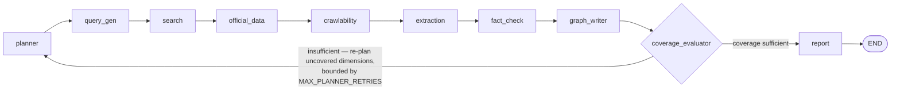

# Architecture — orchestration, agents, data, and trust

The README is the operator's guide. This document is the design record: who
invokes what, what each node reads and writes, where information lives and why,
and what was deliberately left out. [docs/DEPLOYMENT.md](docs/DEPLOYMENT.md)
covers the runtime view — every dependent service and how to deploy it.

## The problem, as understood

A City Lead is about to meet health officials in a city nobody on the team has
researched. They need a briefing that is *honest* more than it is *complete* —
a confident paragraph of invented context is worse than a blank section, because
it will be repeated in a meeting. So the system is built around a single
governing rule: **nothing reaches the brief without a source, and anything we
could not establish is stated as unknown.**

Everything below follows from that.

## Request entry points

`app/main.py` is the only caller of the graph. Everything else is reached
through it, and the read endpoints exist so provenance survives the run that
produced it.

| Endpoint | Invokes | Notes |
|---|---|---|
| `POST /research` | `jobs.registry.submit(...)` | Registers a background job and returns its id in milliseconds. A run is 10–20 minutes and every proxy in the path has a shorter deadline than that, so the request cannot be the thing that waits — see [`app/jobs.py`](app/jobs.py). |
| `GET /research/{job_id}` | `jobs.registry.get(...)` | Per-node state, elapsed time and what each node produced, then the brief plus per-tier counts, coverage, degradation warnings and the run's per-model token cost. Drives the UI's stage checklist. |
| `DELETE /research/{job_id}` | `jobs.registry.cancel(...)` | Stops the pipeline between nodes. Anything already persisted stays — a partial audit trail is still a true record of what was read. |
| `POST /ask` | `vector_store.query` + `graph_store.query_facts_for_city` | Conversational retrieval over two stores, answered with inline citations, refused when the evidence does not support an answer. |
| `GET /graph/{city}` | `graph_store.query_facts_for_city` | Reads Neo4j through Graphiti's hybrid search, with temporal validity per edge. |
| `GET /report/{city}` · `/download` | `relational_store.get_report` | The stored brief as JSON, or as a downloadable `.md`. |
| `GET /sources/{city}` | `relational_store.get_sources` | Every URL considered and the gate's verdict — including refusals. |
| `GET /facts/{city}` | `relational_store.get_facts` | The audit trail: tier, reasoning, origin URL, corroborators. |
| `GET /cities` | `relational_store.list_cities` | What is already in the asset. |
| `GET /health` | `settings.RUN_MODE` | Liveness + which mode the process booted in. |

## Orchestration

`app/graph/workflow.py` compiles the graph once at import; `workflow` is reused
across requests. Nodes never call each other — every node receives the shared
state, returns a partial update, and LangGraph merges it.

Only one edge is conditional, and that is a deliberate choice rather than an
unfinished one. Branching is a claim that two paths are genuinely different
work. Everywhere else in this pipeline the variation is in what a node *finds*,
not in what happens next — the crawlability gate does not need a branch, because
`extraction_node` enforces it by filtering to ALLOWED URLs before issuing a
single request, which is a stronger guarantee than a routing rule that a later
edit could bypass. The one place the path really does differ is coverage: either
the brief is good enough to write, or the planner gets another attempt.

## Decomposition: what "understanding a city" means here

Research is split into five fixed dimensions (`app/models/schemas.py`):

| Dimension | What it covers |
|---|---|
| `cv_burden` | Prevalence of hypertension, diabetes, dyslipidaemia; mortality; screening coverage |
| `healthcare_programmes` | Programmes and interventions running in the city, who runs them, since when |
| `policy_initiatives` | Municipal strategies, NCD action plans, salt/tobacco regulation, budget commitments |
| `stakeholders` | Health department, ministries, hospitals, universities, NGOs, funders and their roles |
| `health_system` | Primary care capacity, workforce, medicines availability, financing, referral pathways |

Two decisions worth defending:

- **The set is fixed, not LLM-generated per city.** A generated set would fit
  each city better and make no two cities comparable. Fixing it is what lets the
  coverage evaluator say *"we know nothing about policy in this city"* — a
  sentence that requires knowing policy was in scope.
- **"Opportunities and risks" is not a dimension.** It is the judgement the City
  Lead is paid to make. The honest machine contribution to it is the gap log —
  what we could not establish — not synthesised commentary.

The dimension *brief* is prompt text, not documentation: it is what the query
generator and claim extractor are told the dimension means, so editing it
changes system behaviour.

## The ten nodes

| Node | Task | Calls LLM | Writes to state |
|---|---|:---:|---|
| `planner` | Puts all five dimensions in scope on the first pass. On a retry, narrows `focus_dimensions` to the dimensions that came back empty, so pass two spends its whole budget on the shortfall. | — | `dimensions`, `focus_dimensions`, `retry_count` |
| `query_gen` | One call covers every in-scope dimension, returning queries per dimension biased toward government / WHO / NGO primary sources. Queries already tried are excluded; keyword templates fill in for any dimension the model leaves empty, because a dimension with no queries is a guaranteed gap. | yes | `planned_queries` |
| `search` | Discovery only — no page bodies fetched. Tavily → `ddgs` → canned mock. Drops URLs seen in an earlier pass and caps candidates **per dimension**, so an abundant dimension cannot crowd out a sparse one. A failing provider is named in a warning rather than returning a silent empty list. | — | `candidates`, `warnings` |
| `official_data` | Pulls `cv_burden` and `health_system` indicators from WHO GHO and World Bank Open Data. Values are *read* from JSON, not extracted from prose, so these bypass LLM adjudication and are tiered by rule; all are marked country-level. | — | `candidates`, `crawl_results`, `passages`, `fact_checked`, `warnings` |
| `crawlability` | The compliance gate, before anything is crawled. Hard ToS denylist (LinkedIn, Facebook, Instagram, X) → `robots.txt` for the specific path → `X-Robots-Tag` header. robots.txt is fetched with an explicit timeout and cached per origin; checks run on a thread pool. | — | `crawl_results` |
| `extraction` | Filters to ALLOWED URLs *before* any request, fetches, rejects non-HTML and `meta robots noindex` pages, then asks for atomic claims tagged `is_city_level`. Skips URLs already *attempted*, whether or not they succeeded. Fetch + extract run on a thread pool. A failed fetch becomes a warning, never a fact. | yes | `passages`, `claims`, `warnings`, `attempted_urls` |
| `fact_check` | Adjudicates each claim against passages from *other* domains only, never told which passage produced it. Must **name** the sources it relies on; VERIFIED is then re-derived from that evidence. Malformed output fails safe to UNSUPPORTED. Same-domain claims share one call, matched back by label. | yes | `fact_checked` |
| `graph_writer` | The only node that touches persistence. UNSUPPORTED claims become `Gap`s and never reach any store as facts. Relational write is required; vector and graph writes degrade to warnings. | — | `gaps`, `warnings`, `persisted_claim_ids`, `indexed_urls` |
| `coverage_evaluator` | Counts **dimensions** with at least one usable fact, not facts in total. Below `MIN_DIMENSIONS_COVERED` it routes back to the planner naming the shortfall; at the retry ceiling it terminates and logs one gap per uncovered dimension. | — | `coverage_sufficient`, `covered_dimensions`, `uncovered_dimensions`, `gaps` |
| `report` | Groups facts by dimension with the tier travelling on each fact, sources on every fact at every tier, gaps and refused sources stated explicitly. Persists the brief and the final gap list. | yes | `report_markdown` |

### Two kinds of source, and why both

Web discovery and official statistics APIs answer different questions, so the
pipeline runs both and splits them by dimension rather than picking a winner.

Official APIs are the better source where a maintained time series exists.
WHO GHO and the World Bank publish cardiovascular risk and health-system
capacity as versioned indicators, which removes the crawlability risk, the
HTML-parsing fragility and the extraction step all at once. But they publish
**by country**. Asking WHO about Pune returns data about India.

Web discovery is the only source for the rest. No API publishes that Pune's
municipal corporation screened 5.53 lakh men for hypertension, or which NGO
partners with which hospital. `healthcare_programmes`, `policy_initiatives`
and `stakeholders` exist on municipal sites and in local reporting or nowhere.

| Dimension | Primary source | Granularity |
|---|---|---|
| `cv_burden` | WHO GHO (`BP_04`, `NCDMORT3070`, `NCD_BMI_30A`) + web | country + city |
| `health_system` | World Bank (`SH.MED.BEDS.ZS`, `SH.MED.PHYS.ZS`, `SH.MED.NUMW.P3`, `SH.XPD.CHEX.GD.ZS`) + web | country + city |
| `healthcare_programmes` | Web discovery only | city |
| `policy_initiatives` | Web discovery only | city |
| `stakeholders` | Web discovery only | city |

Three consequences fall out of this, and the first is the one that matters:

- **Country-level data is labelled, not blended.** Every API-derived fact
  carries `national_vs_city_flag`, which the brief renders as *"⚠️
  national/regional data, not confirmed city-specific"*. This is national
  context for a city brief. Presenting it as a finding about the city would be
  precisely the error the flag exists to catch, and it would be invisible.
- **These facts skip the fact-checker, and say so.** The adjudicator exists to
  catch an LLM inventing or distorting a claim while reading prose. Nothing in
  this path involves an LLM — a field is copied out of a JSON document — so
  there is no fabrication to detect, and the tier is assigned by rule instead.
  The `reasoning` string states that explicitly so the two provenance paths
  stay distinguishable in the audit trail rather than looking equivalent.
- **They raise corroboration on the web path as a side effect.** The indicator
  text is indexed as an ordinary passage, so the fact-checker can cite an
  official statistic as independent support for a scraped claim. `VERIFIED` is
  hard to reach from web sources alone; an authoritative second source is
  exactly what the tier was waiting for.

Set `ENABLE_OFFICIAL_DATA=false` to demo web discovery on its own.

### How trust is actually enforced

Three mechanisms, in the order a claim meets them:

1. **Structural independence.** The fact-checker receives the claim text and
   passages from other domains, labelled `[S1]`, `[S2]`. It is not told which
   passage produced the claim or what the extractor concluded, so it cannot
   rubber-stamp — it has to find support in material the extractor did not use.
   Same-domain passages are excluded: a site agreeing with itself is not
   corroboration.
2. **Cited provenance, not asserted provenance.** The checker must name the
   labels it relied on. Those labels are mapped back to real URLs, and a label
   that was never offered is discarded. `corroborating_urls` therefore contains
   only sources the checker actually cited. *(This was the single worst bug in
   the earlier version: the field was filled with every other-domain URL in the
   run, which made the report's "Sources:" line present and meaningless.)*
3. **Derived tiers.** VERIFIED is recomputed from the count of distinct
   supporting domains. A claim cannot reach VERIFIED without
   `MIN_SOURCES_FOR_VERIFIED` independent sources no matter what tier the model
   asked for, and the automatic downgrade is written into the fact's reasoning
   so the reader can see it happened.

`UNSUPPORTED` then has a consequence rather than a label: `graph_writer_agent.py`
filters those claims out of `persistable` and rewrites them as gaps, so a claim
the fact-checker could not corroborate cannot physically reach a store as a fact.

## Memory

Three tiers with very different lifetimes.

### Tier 1 — working memory: one HTTP request

`CityResearchState` (`app/graph/state.py`) is a `TypedDict` LangGraph merges
partial updates into. Fields marked `Annotated[..., append_list]` **accumulate
across retry passes** — the evidence base only grows. Everything else is
last-write-wins and describes the current pass.

| State field | Merge | Written by |
|---|---|---|
| `city`, `country` | set once | `main.py` |
| `dimensions`, `focus_dimensions` | overwrite | `planner` |
| `planned_queries` | overwrite | `query_gen` |
| `candidates` | **append** | `search` |
| `crawl_results` | **append** | `crawlability` |
| `passages`, `claims` | **append** | `extraction` |
| `fact_checked` | **append** | `fact_check` |
| `gaps` | **append** | `graph_writer`, `coverage_evaluator` |
| `warnings` | **append** | `extraction`, `graph_writer` |
| `persisted_claim_ids`, `indexed_urls` | **append** | `graph_writer` |
| `retry_count`, `coverage_sufficient`, `covered_dimensions`, `uncovered_dimensions` | overwrite | `planner`, `coverage_evaluator` |
| `report_markdown` | overwrite | `report` |

Because the retry loop re-enters nodes over accumulating state, **every node is
idempotent with respect to a retry**: each filters to the items it has not
already handled (`already_checked`, `already_extracted`, `persisted_claim_ids`).
Without that, pass two re-fetches pass one's URLs, re-adjudicates its claims and
writes duplicate audit rows and graph episodes.

`build_workflow()` ends with a bare `graph.compile()` — **no checkpointer**.
There is no thread id and no resumable run. The state object is garbage once the
response is serialized; the only thing that outlives a request is what
`graph_writer` and `report` persisted.

### Tier 2 — long-term memory: three stores

Three stores because there are three genuinely different questions, and a single
store answers one of them well and the others badly.

**SQLite — governance** (`stores/relational_store.py`)
*"Was this sourced legitimately, when, by what decision, and why?"* Exact,
row-level, auditable questions about individual records.

| Table | Contents | Write mode |
|---|---|---|
| `sources` | Every crawl verdict, **allowed and denied**, with reason, dimension, timestamp | `merge` on URL |
| `fact_audit` | Tier, reasoning, origin `source_url`, corroborators, `national_vs_city_flag`, and a `reviewed_by_human` column reserved for a review queue | append |
| `gaps` | Description + reason per gap | append |
| `reports` | The generated brief per city | `merge` on city |

It is the only store that keeps **denied** sources. Recording what we chose not
to read is part of the evidence trail: a reviewer can see the gate ran and what
it cost, instead of trusting that it did.

**Milvus — semantic recall** (`stores/vector_store.py`)
*"What is being done about X?"* One row per ALLOWED passage — city, dimension,
url, title, text, and a local `all-MiniLM-L6-v2` embedding, COSINE metric,
primary key = SHA-256 of the URL so re-researching upserts instead of
duplicating. Raw passages live here, never adjudicated facts: this store is for
recall over material the schema never anticipated, and fact status is not a
property you want resolved by nearest-neighbour distance. Queries are filtered
to the city so one city's passages can never be cited as evidence about another.

**Neo4j / Graphiti — institutional memory** (`stores/graph_store.py`)
*"How do these things relate, and what changed?"* Each fact-checked claim becomes
a Graphiti `add_episode`, with tier, dimension and source URLs written into the
episode body so provenance survives entity extraction. Graphiti extracts
entities and relationships and gives temporal edges: a superseded fact gains an
`invalid_at` rather than being overwritten, which is what lets this store answer
*"what did we believe about this city six months ago"*.

Read at query time by `GET /graph/{city}` and by `POST /ask`, through Graphiti's
hybrid search — semantic search over edge embeddings plus BM25, reranked. It
returns **edges, not nodes**, because in Graphiti the edge *is* the fact
("X runs programme Y") and the edge carries the validity window.

Graphiti normally wants an OpenAI key for chat, embeddings and reranking. Here
only chat is remote: `app/llm/embeddings.py` provides a local `EmbedderClient`
and a cosine-similarity `CrossEncoderClient` off the same sentence-transformers
model. That decouples the graph from the chat provider entirely — providers with
no `/embeddings` route work fine, and there is no second API key to manage.

### Tier 3 — LLM memory: none, deliberately

`llm_client.complete(system, user)` builds a fresh single-turn message array
every call. No conversation history is threaded between nodes or between claims.
That statelessness is what makes the fact-checker's independence real rather
than nominal — it cannot remember having just extracted the claim it is judging.

## Cost and latency budget

Unbounded, a five-dimension run fans out to roughly 50 candidate URLs, 50
extraction calls, and 100 fact-check calls each carrying every other passage as
context: minutes of latency and a context window spent on the first city. The
caps in `app/config.py` are the main answer to "what did you cut":

| Knob | Default | Bounds |
|---|---|---|
| `QUERIES_PER_DIMENSION` | 2 | searches per dimension per pass |
| `MAX_SOURCES_PER_DIMENSION` | 4 | candidate URLs kept per dimension |
| `MAX_CLAIMS_PER_PASSAGE` | 3 | claims extracted per source |
| `FACT_CHECK_CONTEXT_PASSAGES` | 4 | rival passages shown per claim |
| `FACT_CHECK_CONTEXT_CHARS` | 1500 | characters of each rival passage |
| `FACT_CHECK_BATCH_SIZE` | 5 | claims sharing one adjudication call |
| `PASSAGE_CHAR_LIMIT` | 5000 | characters **kept** per fetched page |
| `EXTRACTION_CHAR_LIMIT` | 2500 | characters **sent** to the claim extractor |
| `LLM_MAX_CONCURRENCY` | 4 | parallel extraction / fact-check calls |
| `HTTP_MAX_CONCURRENCY` | 8 | parallel robots.txt, HEAD and page fetches |
| `SEARCH_MAX_CONCURRENCY` | 3 | parallel search queries |
| `GRAPH_WRITE_CONCURRENCY` | 1 | parallel Graphiti episode writes |
| `GRAPHITI_SEMAPHORE_LIMIT` | 4 | Graphiti's own parallel extraction calls |
| `MIN_DIMENSIONS_COVERED` | 3 | dimensions needed before the brief is written |
| `MAX_PLANNER_RETRIES` | 2 | re-plan passes |

Selecting the fact-check context by lexical overlap rather than showing
everything is not only cheaper — it keeps the model's attention on material that
could actually settle the question. The window within each passage is chosen
the same way, rather than taken from the front: head-truncation costs exactly
the same tokens and routinely cut away the one sentence that would have settled
the claim, because on a long report the relevant figure is rarely in the
opening paragraph.

That same selection is why `EXTRACTION_CHAR_LIMIT` can sit at half of
`PASSAGE_CHAR_LIMIT`. Extraction is the run's largest single input payload —
one call per source, and the prompt is the page — and the window sent is scored
against the dimension brief, so the characters dropped are the masthead and the
cookie notice rather than the programme description. The full passage is still
stored and embedded, so `/ask` recall is unaffected.

Three of these bound *concurrency* rather than volume, and they are separate
numbers because they are limited by different things. `LLM_MAX_CONCURRENCY` is
a quota; `HTTP_MAX_CONCURRENCY` is sockets; `SEARCH_MAX_CONCURRENCY` is what a
consumer search engine tolerates before it rate-limits. They used to be one
number, which meant the correct value for a per-second-metered LLM provider —
1 — also fetched forty pages strictly one at a time.

**Two models, by role.** `LLM_MODEL` serves the ~30 calls a run makes that are
judgements; `LLM_BULK_MODEL` serves the ~120 that fill a fixed JSON schema from
text in front of them, including all of Graphiti's entity extraction. On the
Mistral defaults that is a ~3x price difference per token for output the reader
cannot distinguish, and every finished job reports calls and tokens per model
so the split is verifiable rather than assumed.

**Where the tokens actually went.** Caps alone made the run bounded, not
efficient. Measured against the defaults, one pass sends roughly 26k tokens of
extraction — each page once, which is optimal — and roughly 108k tokens of
fact-checking, about 78% of the total. That was almost entirely duplication:
a claim's corroboration context and the system prompt were re-sent for every
claim, so twenty sources and sixty claims sent something like twelve times
more text than the run had ever read. Adjudicating same-domain claims together
cuts that by roughly 3x in tokens and in calls, and the calls matter twice over
on a provider metered per second, where every call is wall-clock.

The grouping is only sound because the corroboration pool already excludes the
claim's *own* domain. Claims sharing an origin domain therefore face an
identical candidate set, and batching changes what is sent, not what the
checker is allowed to see. Two safeguards go with it: verdicts are matched to
claims by the label the model echoes rather than by list position — otherwise
one dropped entry shifts every later verdict onto the wrong claim, attaching
one claim's sources to another — and any claim the batch fails to answer for is
re-asked on its own, so batching can cost an extra call but never a verdict.

## Datastore configuration

`RUN_MODE` is a single switch across four subsystems; they cannot currently be
selected independently.

| Subsystem | `MOCK` | `LIVE` |
|---|---|---|
| Relational | SQLite via `DATABASE_URL` | SQLite via `DATABASE_URL` (unchanged) |
| Vector | in-memory keyword-overlap stand-in | Milvus (Lite embedded, or a cluster) |
| Graph | in-memory adjacency lists | Neo4j Sandbox via Graphiti |
| LLM | canned deterministic responses | any OpenAI-compatible chat endpoint |
| Search | canned candidate URLs | Tavily, or `ddgs` without a key |
| Embeddings | not used | local sentence-transformers |

**SQLite needs no configuration** and never branches on run mode. Swapping in
Postgres is a `DATABASE_URL` change with no code edits.

**Milvus requires `RUN_MODE=LIVE`**, because the backend is chosen on first use.
Topology, though, is independent of run mode: `MILVUS_URI` ending in `.db` runs
Milvus Lite embedded, while an `http://` or Zilliz endpoint targets a cluster.

All three stores share one lazy proxy (`app/stores/lazy.py`) that defers
construction to the first attribute access, and the LLM client does the same
internally. An unreachable dependency therefore degrades one feature rather
than stopping `app.main` from importing — which would take `/health` down with
it and leave the container restarting.

For how each of those dependencies is actually provisioned, see
[docs/DEPLOYMENT.md](docs/DEPLOYMENT.md).

## Behaviour when the outside world is unavailable

Every external dependency has a defined degraded mode, and the rule behind all
of them is the same: **a dependency that fails costs the feature it serves, and
is disclosed on the run.** Nothing that fails is allowed to become a fabricated
fact, and nothing that fails silently.

| What fails | What happens | Where |
|---|---|---|
| One search query (rate limit, provider outage, renamed dependency) | Returns no candidates for that query **and a warning naming the provider and the exception type**. The dimension it served becomes a gap if nothing else covers it | `search_agent._run_query` |
| Every search query in a pass | The per-query warnings are deduplicated to one, plus a summary stating that this was a provider problem rather than an absence of information — because the gaps it produces are otherwise worded as though the research ran and found nothing | `search_agent.search_node` |
| Search entirely | Zero web candidates. `cv_burden` and `health_system` still come from the official APIs; the other three dimensions run the retry loop to exhaustion and are reported as gaps | `coverage_evaluator` |
| One official indicator (archived, or no data for the country) | That indicator is skipped with a warning naming it. The dimension still has its other indicators, and the web path, behind it | `official_data_agent._gather` |
| Official APIs entirely | `cv_burden` and `health_system` fall back to web discovery alone, exactly as if the feature were switched off | `official_data_agent` |
| `country` missing from the request | Official statistics are skipped with a warning saying why, since these APIs are keyed by country. The city research is unaffected | `official_data_agent.official_data_node` |
| `robots.txt` unreachable | ALLOWED, because absence of a robots.txt is not a prohibition — but the reason string records that it was *"nobody said no"* rather than an explicit permission | `crawlability_agent._check_robots_txt` |
| `X-Robots-Tag` HEAD request fails | Inconclusive; the robots.txt verdict stands | `crawlability_agent._check_noindex_header` |
| One page fetch | Source dropped with a recorded warning, and the URL is recorded as *attempted* so later passes do not re-fetch a known-dead link and repeat its warning | `extraction_agent._fetch_source` |
| The HTML parser is not installed | Checked once per pass, before any network work, and reported as a single warning naming the package and the `pip` command. Per-source this produced one identical warning per candidate, which read like a web outage | `extraction_agent._missing_parser_dependency` |
| A source that is not readable prose (PDF, CSV, JSON, image) | Refused before parsing, by exact MIME type. Feeding bytes we cannot read to a model produces confident nonsense, which is worse than a gap | `extraction_agent._PARSER_FOR_TYPE` |
| A source that parses to almost nothing | Dropped with the character count in the warning, rather than sent on. Extraction costs one model call per source, so an empty page would buy an empty answer at full price | `extraction_agent._real_fetch` |
| Claim extraction call | Passage is still indexed for semantic search, but yields no claims, plus a warning | `extraction_agent._extract_claims` |
| Fact-check adjudication | Claim is forced to UNSUPPORTED — dropped rather than trusted — and therefore becomes a gap | `fact_check_agent._unadjudicated` |
| A batched adjudication the model answers incompletely | Each unanswered claim is re-asked in its own call. Batching is an optimisation, so it is not allowed to cost a claim its verdict | `fact_check_agent._adjudicate_group` |
| Query planning call | Falls back to keyword templates for every dimension, plus a warning. Generic searches beat no searches, and beat a 500 | `query_gen._plan_with_model` |
| Narrative call | Deterministic factual summary instead of prose; the facts below are the substance | `report_agent._narrative` |
| Milvus | Passages are not indexed; a warning is recorded. Costs `/ask` recall only | `graph_writer_agent` |
| Milvus collection with an incompatible schema | Detected on init and recreated, because a stale Int64 primary key would otherwise fail every upsert forever — `has_collection()` cannot see it. Every check fails *open*, since dropping is destructive | `vector_store._ensure_collection` |
| One fact's graph episode (e.g. LLM rate limit inside Graphiti) | That fact is skipped; the rest are still written. One batched warning reports how many failed and which system to blame | `graph_writer_agent` |
| Neo4j (e.g. expired Sandbox) | Facts still land in the relational audit trail; graph exploration is unavailable and `/graph/{city}` returns 503 with that hint | `graph_writer_agent`, `main.py` |
| SQLite | **Propagates.** Losing the audit trail means losing the evidence guarantee, so this one is deliberately fatal | `graph_writer_agent` |

The composite case is a total blackout — no search *and* no reachable LLM,
which is the realistic one since the model is hosted too. That path is covered
by `test_total_outage_still_produces_an_honest_report`, which asserts the run
finishes with an all-gaps brief, spends its full retry budget, invents nothing,
and discloses the degradation in a **Run Warnings** section. Note that the test
has to disable the official APIs explicitly to make the blackout total: they
are a separate dependency from the model, and
`test_official_statistics_survive_an_llm_outage` asserts the complement — that
with search and the LLM both dead, those two dimensions still produce real,
sourced facts and only the other three become gaps.

There is deliberately **no automatic fallback to `RUN_MODE=MOCK`**. Serving
canned data that looks like research would be a worse failure than an honest
empty report.

**The cost of this design, learned the hard way.** Swallowing an exception into
a warning is right for a transient outage and wrong for a programming error,
and the graph write path could not tell them apart. A missing required
argument to Graphiti's `add_episode` raised `TypeError` on every write, was
downgraded to "Graph store unavailable", and presented as an empty knowledge
graph rather than as a bug — while the warning text sent the reader off to
check the Neo4j Sandbox. Two consequences now baked in: the warning branches
on exception class so an API mismatch says so, and `graphiti-core` is pinned
exactly, because that pin is load-bearing rather than hygiene. The general
lesson is that graceful degradation needs to distinguish *"the world is
broken"* from *"this code is wrong"*, or it will hide the second one
indefinitely.

The same lesson arrived a second time from the opposite direction, and it is
worth recording because the first fix did not prevent it. A deployment with
`beautifulsoup4` missing raised `ModuleNotFoundError` inside the per-source
fetch handler, which dutifully degraded it — producing one *"Could not read
\<url\>"* warning for each of thirty candidates, repeated once per retry pass.
The run finished, every dimension was a gap, and the output was indistinguishable
from a city nobody has written about. Nothing was silent; it was worse than
silent, because ninety warnings about individual URLs actively argued that the
problem was the web. The corrections were to check environment-wide faults
**once, up front, where their scope is obvious**, and to make
`scripts/check_services.py` verify imports before it verifies anything
reachable. Generalised: the unit a failure is reported at should match the unit
it actually applies to, or the reader will infer the wrong cause from the
right facts.

## How this is evaluated

Three layers, of which two exist.

**In-loop, at runtime.** The coverage evaluator grades each pass on dimensions
covered rather than facts found, and the fact-checker grades each claim on
independently cited corroboration. Both have teeth: the first drives the retry
edge, the second decides whether a claim can be reported at all.

**Offline, deterministic.** `tests/test_pipeline.py` runs the full nine-node
graph in MOCK mode with no internet, keys or Neo4j, asserting the
non-negotiables as contracts — the gate excludes denied URLs from extraction,
every reportable fact's source URL appears in the report body, UNSUPPORTED
becomes exactly one gap and never a fact, and claim IDs stay unique across
retries.

What makes the suite worth more than a smoke test is that the mock is
adversarial rather than cooperative. The mock adjudicator returns
`SINGLE_SOURCE` with an empty `supporting_sources` list, so the tier-derivation
rule is exercised instead of bypassed by a mock that hands back VERIFIED for
free. Tests then inject hostile adjudicator output directly — including a
`supporting_sources` label that was never offered — to prove a hallucinated
citation cannot become provenance.

**What does not exist.** No golden dataset of cities with reference facts, so
no precision/recall on extraction and no accuracy on tier assignment. No judge
or human rating of narrative faithfulness. No regression scoring across model
swaps — which is the sharp edge, because changing provider is currently
validated only by "the tests still pass", and they would pass even if fact
quality collapsed, since MOCK mode never calls the real model. Cost and latency
are bounded by config but never measured.

So the suite proves the machinery **cannot fabricate**. It does not prove the
facts it surfaces are the **right** facts. The first property is what the
non-negotiables gate on, which is why it was built first; the second is the
obvious next investment, and the cheapest useful version is a small golden set
(a few cities × five dimensions) scored on source precision and dimension
recall.

## Trade-offs and what was cut

**Cut deliberately:**

- **No human review queue.** The brief flags what needs review (every
  SINGLE_SOURCE and CONFLICTING fact, plus the `national_vs_city_flag`) and
  `fact_audit.reviewed_by_human` is the column a queue would write to, but
  nothing blocks on a human today. For a briefing tool where the reader is the
  domain expert, surfacing confidence beats gating on a reviewer who is the same
  person.
- **Progress is polled, not pushed.** A run reports each node's state, duration
  and output, but the client asks for it every two seconds rather than being
  told. Against a 10–20 minute run that interval is free, and it keeps the
  progress path to one ordinary endpoint instead of a second transport that has
  to survive the same proxies. SSE or a websocket is the upgrade if the
  pipeline ever gets fast enough for two seconds to feel slow.
- **Jobs are in-process, not a durable queue.** A job is a handle on a running
  asyncio task, so a restart forgets the ones in flight. Finished work is
  unaffected — the pipeline writes the brief, facts, sources and gaps to the
  relational store as it goes, so `GET /report/{city}` answers with or without
  the job. Celery or an outbox table is the change that horizontal scaling
  forces, alongside moving off SQLite; neither is justified by one container.
- **No PDF or non-HTML extraction.** Government portals publish a lot of PDFs
  and the extractor rejects them with a recorded warning rather than feeding
  their bytes to an LLM and getting confident nonsense. This is the single
  biggest recall limitation.
- **Named entities are Graphiti's job, not a dedicated NER pass.** A richer
  schema would extract `Organization`/`Programme`/`Policy` nodes explicitly with
  typed relationships. Episodes let Graphiti do that extraction, at the cost of
  less control over the resulting shape.
- **One embedding model, no dedicated cross-encoder.** Reranking is cosine
  similarity over the same bi-encoder. A real cross-encoder ranks better; it is
  a second model download for marginal gain at this corpus size.
- **No freshness policy.** `sources.fetched_at` and `reports.generated_at`
  record when evidence was gathered, and `/cities` surfaces the latter, but
  nothing acts on age. Re-running a city overwrites the brief; there is no
  staleness threshold that triggers a refresh.

- **Evaluation covers process, not output quality.** There is no golden
  dataset, so there is no precision/recall figure for extraction and no
  accuracy figure for tier assignment. See "How this is evaluated" above for
  what that does and does not buy.

**Known limitations:**

- Coverage is judged by *presence* of a usable fact per dimension, not by
  depth. Three thin facts about policy count the same as thirty.
- `ddgs` without a Tavily key returns noticeably noisier results, which shows
  up as more UNSUPPORTED verdicts rather than as wrong facts. It is also a
  scraper of consumer search engines, so it rate-limits under the ~10 queries
  a pass issues — which the run now reports rather than absorbing.
- Milvus Lite is Linux/macOS only, so Windows development needs Docker or a
  remote endpoint.
- A Neo4j Sandbox expires after 3 days (extendable to 10) and returns with a new
  IP and password, so a long-lived deployment needs Aura instead.
