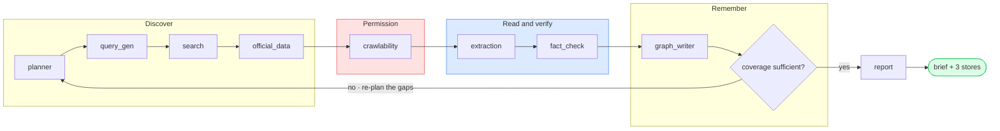

# CARDIO4Cities
## City Intelligence

Preparing a City Lead for a stakeholder meeting **in a city nobody has researched**

<div class="pt-8 text-sm opacity-70">
Live internet research → independent verification → a reusable, evidence-linked asset
</div>

<div class="abs-br m-6 text-xs opacity-50">
Slides 1–8: the deck · 9+: architecture appendix
</div>

<!--
Opening frame. The one sentence that matters: this is not a summarisation
tool, it is a verification pipeline that happens to write a brief.

Say up front that slides 1-8 are the deck and the rest is an appendix I
will pull from when we get to "explain your architecture".
-->

---
layout: default
---

# 1 · The problem, as I understand it

A City Lead meets health officials in a city the team has never researched. Today that is
days of manual work across government portals, reports, statistics and policy documents —
producing knowledge that is **fragmented, hard to verify, and not reusable** by the next person.

<div class="grid grid-cols-2 gap-6 pt-4">
<div>

### The naive AI answer fails
"Ask a model about the city" produces fluent, plausible, unsourced prose.

<div class="mt-4 p-4 border-l-4 border-red-400 bg-red-50 dark:bg-red-900/20 text-sm">

A confident paragraph of **invented context is worse than a blank section**, because it gets
repeated in a meeting with a health minister.

</div>
</div>
<div>

### So the design goal is not completeness
It is **honesty under time pressure**.

<v-clicks>

- Every statement traceable to a real URL
- Every unknown said out loud, not smoothed over
- National data never passed off as city data
- A degraded run says it degraded

</v-clicks>
</div>
</div>

<!--
The framing decision that drives every other decision in the system. If you
optimise for a complete-looking brief you get a fabrication machine. If you
optimise for honesty you get gaps, and gaps are the useful output — they tell
the Lead what to ask in the room.

Expect the question "isn't a sparse brief a failure?" Answer: a sparse brief
that is true is a working brief. A full brief you cannot check is a liability.
-->

---
layout: default
---

# 2 · The solution — a verification pipeline
 
<div class="flex justify-center my-2">
  <div class="w-full max-w-4xl text-xs flex justify-center my-2">


 
  </div>
</div>
<div class="text-xs opacity-70 text-center">
Nine agents in a loop. The <span class="text-red-500 font-semibold">permission gate</span> and the
<span class="text-blue-500 font-semibold">verify step</span> are what make it a pipeline rather than a summariser.
</div>
<!--
Walk it left to right once, then make the two points that matter:
1. The red block is a hard gate - we check robots.txt and terms before we
   read anything. Nothing downstream ever sees a page we were not allowed
   to fetch.
2. The blue block is why this is not a summariser. Extraction pulls claims,
   fact_check independently re-verifies each one against its source.
Then the loop: if coverage is insufficient we re-plan against the gaps
rather than padding the brief.
-->

<!--
Walk left to right. The shape of the pipeline is the argument: discovery is
cheap and wide, permission narrows it, verification is the expensive middle,
and persistence is what makes the second person to ask about this city not
pay for it again.

The loop back to planner is the only conditional edge in the graph. It
re-plans the dimensions that came back empty, not the whole run.
-->

---
layout: default
---

# 3 · What "understanding a city" is decomposed into

Five **fixed** dimensions, matching what the Lead actually needs in the room:

| Dimension | What it covers |
|---|---|
| **Cardiovascular burden** | hypertension / diabetes / dyslipidaemia prevalence, mortality, screening coverage |
| **Healthcare programmes** | what is running, who runs it, since when |
| **Policy & regulation** | NCD action plans, municipal strategies, salt/tobacco regulation, budget |
| **Stakeholders** | health department, ministries, hospitals, universities, NGOs, funders |
| **Health system capacity** | primary care, workforce, medicines availability, financing, referral |

<div class="grid grid-cols-2 gap-6 pt-4 text-sm">
<div>

**Fixed, not generated per city.** A generated set fits each city better and makes no two cities
comparable. Fixing it is what lets the system say *"we know nothing about policy here"* — a
sentence that requires having known policy was in scope.

</div>
<div>

**"Opportunities and risks" is deliberately not a dimension.** The brief lists it, and it is the
Lead's judgement to make. The honest machine contribution is the **gap log**: what we could not
establish. Inventing commentary there would be the highest-stakes fabrication in the product.

</div>
</div>

<!--
This answers the brief's first open design question directly. The
counter-intuitive choice is fixing the dimension set rather than letting a
model invent one per city.

Two consequences worth stating: comparability across cities, and the ability
to report a *negative* — you cannot report "nothing on policy" unless policy
was a slot you were trying to fill.

The dimension briefs are prompt text, not documentation — they are what the
query generator and claim extractor are told the dimension means.
-->

---
layout: default
zoom: 0.88
---

# 4 · Trust and evidence — four mechanisms

<div class="grid grid-cols-2 gap-5 text-sm pt-2">

<div class="p-4 rounded border-l-4 border-blue-500 bg-blue-50 dark:bg-blue-900/20">

### 1 · Structural independence
The fact-checker is given the claim plus passages **from other domains**, labelled `[S1]`, `[S2]`.
It is never told which passage produced the claim, or what the extractor concluded.
Same-domain passages are excluded — *a site agreeing with itself is not corroboration.*

</div>

<div class="p-4 rounded border-l-4 border-violet-500 bg-violet-50 dark:bg-violet-900/20">

### 2 · Cited provenance, not asserted
The checker must **name** the labels it relied on. Labels map back to real URLs; a label never
offered is discarded. So `corroborating_urls` holds only sources that were actually cited —
not every other URL in the run.

</div>

<div class="p-4 rounded border-l-4 border-green-500 bg-green-50 dark:bg-green-900/20">

### 3 · Derived tiers, not declared ones
`VERIFIED` is **recomputed** from distinct supporting domains. A claim cannot reach it without the
required independent sources no matter what tier the model asked for — and the downgrade is
written into the fact's reasoning, visible to the reader.

</div>

<div class="p-4 rounded border-l-4 border-red-500 bg-red-50 dark:bg-red-900/20">

### 4 · `UNSUPPORTED` has a consequence
Unsupported claims are filtered out of persistence one node later and **rewritten as gaps**.
They cannot physically reach a datastore as facts. A failed fact-check call also fails *safe* —
to `UNSUPPORTED`, never to "probably fine".

</div>

</div>

<div class="pt-3 text-xs opacity-70 text-center">
Four tiers: <b class="text-green-600">VERIFIED</b> (≥2 independent domains) · <b class="text-amber-600">SINGLE_SOURCE</b> · <b class="text-orange-600">CONFLICTING</b> · <b class="text-red-600">UNSUPPORTED</b> → becomes a gap
</div>

<!--
This is non-negotiable #4 and #7, and the 20% of the rubric on
trustworthiness. The word to lean on is *structural*: independence here is
not a different prompt, it is a different information set.

Mechanism 3 is the one to demo live. Show a claim where the model asked for
VERIFIED, cited one domain, and got downgraded to SINGLE_SOURCE with the
reason appended. That is the system refusing to take the model's word.

Mechanism 4 is where "with consequences in the workflow" is satisfied — the
consequence is enforced in graph_writer_agent, not in the checker itself.
-->

---
layout: default
zoom: 0.9
---

# 5 · Knowledge management — three stores, three questions

| Store | The question only it can answer | What lives there |
|---|---|---|
| **SQLite / SQLAlchemy** | *Was this sourced legitimately, when, by what decision?* | Every crawl verdict **including refusals**, every fact with tier + reasoning, gaps, reports |
| **Milvus** | *What is being done about X?* | Raw passage text + local embeddings. Never adjudicated facts |
| **Neo4j + Graphiti** | *How do these things relate, and what changed?* | Facts as **temporal edges** with validity windows |

<div class="grid grid-cols-3 gap-4 pt-4 text-xs">
<v-clicks>

<div class="p-3 rounded bg-gray-100 dark:bg-gray-800">
<b>Why keep DENIED sources?</b><br/>
Recording what we deliberately did not read is the evidence trail. A reviewer can see the gate
<i>ran</i> and what it cost, instead of trusting that it did.
</div>

<div class="p-3 rounded bg-gray-100 dark:bg-gray-800">
<b>Why raw passages only?</b><br/>
Fact status is not a property you want resolved by nearest-neighbour distance. Queries are
filtered by city, so one city's passages can never be cited as evidence about another.
</div>

<div class="p-3 rounded bg-gray-100 dark:bg-gray-800">
<b>Why a temporal graph?</b><br/>
A superseded fact gains an <code>invalid_at</code> rather than being overwritten. That is what lets
the store answer <i>"what did we believe six months ago"</i>.
</div>

</v-clicks>
</div>

<div class="pt-4 text-sm">

**Read at query time, not just written.** `GET /graph/{city}` and `POST /ask` both traverse the graph
through Graphiti's hybrid search (semantic over edge embeddings + BM25, reranked).
**Embeddings run locally** (`all-MiniLM-L6-v2`), serving Milvus *and* Graphiti's embedder *and* its
cross-encoder — so the graph is decoupled from the chat provider and there is no second API key.

</div>

<!--
Non-negotiable #6 asks me to justify what lives where, so the table is
organised by question rather than by technology.

The three clicks are the defensible parts. The denied-sources point usually
lands best — it is cheap to store and it is the only way to prove a gate ran.

The local embedding decision is worth 20 seconds: Graphiti embeds every node
and edge it writes, and several good chat providers expose no embeddings
endpoint at all. Embedding on-box means the provider only has to serve chat.
-->

---
layout: default
---

# 6 · User experience

<div class="grid grid-cols-2 gap-6">
<div>

One URL. The pipeline is the **left rail**, so a non-technical user watches the work being done
rather than a spinner.

<v-clicks>

- **Report** — grouped by *dimension* (how you read before a meeting), confidence tier on **every**
  fact with its sources underneath. Downloadable `.md`
- **Sources** — every URL considered and the gate's verdict, refusals included
- **Knowledge graph** — relationships with their validity windows
- **Ask** — answers strictly from indexed evidence with inline `[1]` citations back to the URL or
  graph edge; **refuses** when the evidence does not support one
- **Already researched** — click a city to reopen its stored brief

</v-clicks>

</div>
<div>

<div class="p-4 rounded bg-gray-100 dark:bg-gray-800 text-sm">

### Colour carries confidence, consistently

<div class="pt-2 space-y-2">
<div><span class="inline-block w-3 h-3 rounded-full bg-green-500"></span> <b>Verified</b> — ≥2 independent sources</div>
<div><span class="inline-block w-3 h-3 rounded-full bg-amber-500"></span> <b>Single source</b> — review before relying</div>
<div><span class="inline-block w-3 h-3 rounded-full bg-orange-500"></span> <b>Conflicting</b> — sources disagree</div>
<div><span class="inline-block w-3 h-3 rounded-full bg-red-500"></span> <b>Gap</b> — explicitly unresolved</div>
</div>

</div>

<div class="pt-4 text-sm">

**The second person to ask should not pay for the research again.** That is what makes this a
reusable *asset* rather than a one-shot report generator — and it is why the read endpoints exist
separately from the run that produced them.

</div>

<div class="pt-3 text-xs opacity-60">
Grouping by dimension rather than by tier is deliberate: grouping by tier reads well to an auditor
and badly to the actual user. The tier travels with each fact instead.
</div>

</div>
</div>

<!--
15% of the rubric. The demo beat: run a city, then reopen it from the
"already researched" list to show it came back from storage.

The /ask refusal is worth demonstrating on purpose — ask something the corpus
cannot answer and show it names what is missing instead of guessing.
-->

---
layout: default
---

# 7 · Trade-offs, and what I cut

<div class="grid grid-cols-2 gap-6 text-sm">
<div>

### Cut on purpose

<v-clicks>

- **No human review queue.** The brief flags what needs review and the audit table carries the
  column, but nothing blocks. The reader *is* the domain expert
- **No streaming progress.** Nicer demo, zero extra trust, real SSE plumbing
- **No PDF/table extraction.** Rejected with a recorded warning rather than feeding bytes to an
  LLM. My biggest recall limitation, and the first thing I would add
- **No dedicated NER pass or cross-encoder.** Graphiti extracts entities; reranking is cosine over
  the same bi-encoder

</v-clicks>

</div>
<div>

### Honest limitations

<v-clicks>

- Coverage measures **presence** per dimension, not depth
- Without a Tavily key, search is noisier — which shows up as more `UNSUPPORTED` verdicts, **not**
  as wrong facts. That is the failure mode I wanted
- A Neo4j Sandbox expires in 3–10 days; a durable deployment needs Aura
- Free-tier LLM quotas are the real throughput ceiling: one city is
  **150–250 model calls**, and Graphiti's own entity extraction is the larger half

</v-clicks>

</div>
</div>

<div class="pt-5 p-4 rounded bg-blue-50 dark:bg-blue-900/20 text-sm">

**If I had another two days:** PDF and table extraction, a real cross-encoder, a freshness policy
driving re-research, and per-node streaming to the UI.

</div>

<!--
Engineering judgment, 10% of the rubric, and the brief explicitly says "tell
us what you cut and why".

The Tavily point is the one I most want heard: I chose the degradation
direction. A weak search makes the brief thinner and more honest, not wrong.
That is the whole design in one sentence.

The LLM quota point is real and current — be ready to talk about the local
Ollama path if asked how this scales.
-->

---
layout: center
class: text-center
---

# Appendix

## Architecture walkthrough

Every agent, store, tool and design decision

<div class="pt-6 text-sm opacity-70">
Slides 1–8 are the deck. What follows is for<br/>
<i>"explain your architecture and workflow"</i> and <i>"discuss trade-offs and limitations"</i>
</div>

<div class="pt-8 grid grid-cols-4 gap-2 text-xs opacity-60 max-w-3xl mx-auto">
<div>Requirements → code</div>
<div>Toolchain</div>
<div>Orchestration & state</div>
<div>10 agents, one by one</div>
<div>3 datastores</div>
<div>LLM & embedding layer</div>
<div>API, UI, budget</div>
<div>Degradation & tests</div>
</div>

<!--
Do not present the appendix linearly. Jump to the slide that answers the
question actually asked. The section order mirrors the pipeline order so it
is navigable under pressure — use Slidev's overview mode (press "o").
-->

---
layout: default
---

# Non-negotiables → where they live in the code

| # | Requirement | Where it is satisfied |
|---|---|---|
| 1 | **Live internet research** at request time | `search_agent` (Tavily → ddgs) + `extraction_agent` fetch on every run. No city data is seeded |
| 2 | **Orchestrated agentic workflow** (LangGraph) | `app/graph/workflow.py` — `StateGraph`, 10 nodes, 1 conditional edge |
| 3 | **Crawlability agent**, before anything is crawled | `crawlability_agent` runs *before* `extraction_agent`, which filters to ALLOWED urls |
| 4 | **Independent fact-checker** with consequences | `fact_check_agent` (different information set) + `graph_writer_agent` (UNSUPPORTED → Gap) |
| 5 | **Graphiti + Neo4j Sandbox**, used at query time | `stores/graph_store.py`; read by `GET /graph/{city}` and `POST /ask` |
| 6 | **Three datastores** — relational, vector, graph | `relational_store` / `vector_store` / `graph_store` |
| 7 | **Evidence on every fact** | `FactCheckedClaim.evidence_urls`; every report line renders sources for *every* tier |
| 8 | **No fabrication**; flag national-as-city | Report prose is fact-constrained; `national_vs_city_flag` renders an explicit warning |
| 9 | **Deployed and reachable** | `Dockerfile` + `docker-compose.yml`, one container and one volume; UI served from the same origin as the API — **live at `<URL>`** |

<div class="pt-2 text-xs opacity-60">
Row 9 needs the hosted URL filled in before presenting — the brief requires a URL the reviewers can open.
</div>

<style>
table { font-size: 0.72rem; }
</style>

<!--
The traceability slide. If an evaluator has a checklist, this is the slide
that clears it in one pass.

Two rows are worth pausing on. #3: the gate is enforced structurally rather
than by a routing decision, which I will explain three slides on. #5: "used
at query time" is the clause people skip — the graph is read by two
endpoints, not just written to.
-->

---
layout: default
---

# The complete toolchain <span class="text-sm opacity-60">1 of 2 — orchestration, search, crawl</span>

<div class="grid grid-cols-2 gap-5 text-xs">
<div>

### Orchestration & app
| Tool | Role |
|---|---|
| `langgraph 0.2.60` | `StateGraph`, typed state, reducers, conditional edge |
| `langchain-core` | required by langgraph |
| `fastapi 0.115` | 9 endpoints + static UI mount |
| `uvicorn[standard]` | ASGI server |
| `pydantic 2.11` | every inter-agent contract in `models/schemas.py` |
| `python-dotenv` | `.env` → `app/config.py` |

### Search & crawl
| Tool | Role |
|---|---|
| `tavily-python` | primary search, when key is set |
| `ddgs 9.14` | zero-key fallback (renamed from `duckduckgo-search`) |
| `requests` | robots.txt, `HEAD`, page fetch, REST APIs |
| `beautifulsoup4` + `lxml` | HTML → prose; `lxml-xml` for feeds |
| `urllib.robotparser` | stdlib robots.txt evaluation |

</div>
</div>

<!--
Note what is *not* here: no LangChain agents, no vendor SDK for the model, no
embedding API, no scraping framework. The openai package is used purely as a
protocol client.
-->

---
layout: default
zoom: 0.94
---

# The complete toolchain <span class="text-sm opacity-60">2 of 2 — stores, AI, services</span>

<div class="grid grid-cols-2 gap-5 text-xs">
<div>

### Datastores
| Tool | Role |
|---|---|
| `sqlalchemy 2.0` | 4 tables; SQLite → Postgres by URL alone |
| `pymilvus 2.4` | vector store; Lite (file) or cluster by URI |
| `neo4j 5.27` | Bolt driver |
| `graphiti-core 0.30.2` | temporal knowledge graph over Neo4j |

### AI layer
| Tool | Role |
|---|---|
| `openai 1.109` | **client only** — any OpenAI-compatible endpoint |
| `fastembed` (ONNX) | local `all-MiniLM-L6-v2` embeddings |
| `opentelemetry-*` | optional tracing; off unless `OTEL_ENABLED` |

</div>
<div>

### External services (no code)
| Service | Role |
|---|---|
| WHO GHO API | 3 burden indicators, keyless |
| World Bank API | 4 health-system indicators, keyless |
| Neo4j Sandbox | mandated graph host |

</div>
</div>

<div class="pt-2 text-xs opacity-70">
Testing: <code>pytest</code> + <code>pytest-asyncio</code> — 81 tests, full pipeline in MOCK mode with no keys, no internet and no Neo4j.
</div>

<!--
That openai line is what makes the provider a two-env-var decision — Mistral,
Gemini, Groq, DeepSeek, OpenRouter, OpenAI or a local Ollama, with no code
change. It is a protocol client, not a vendor SDK.
-->

---
layout: default
class: dense
zoom: 0.86
---

# Orchestration — the LangGraph shape

<div class="grid grid-cols-5 gap-4">
<div class="col-span-3">

```python {all|5-9|11-13|15-16}
def build_workflow():
    graph = StateGraph(CityResearchState)
    for name, node in NODES.items():
        graph.add_node(name, _timed(name, node))

    graph.set_entry_point("planner")
    graph.add_edge("planner", "query_gen")
    graph.add_edge("query_gen", "search")
    graph.add_edge("search", "official_data")
    graph.add_edge("official_data", "crawlability")
    graph.add_edge("crawlability", "extraction")
    graph.add_edge("extraction", "fact_check")
    graph.add_edge("fact_check", "graph_writer")
    graph.add_edge("graph_writer", "coverage_evaluator")

    graph.add_conditional_edges(
        "coverage_evaluator", _route_after_coverage,
        {"planner": "planner", "report": "report"},
    )
    graph.add_edge("report", END)
    return graph.compile()
```

</div>
<div class="col-span-2 text-sm">

### One conditional edge, on purpose

Branching is a **claim that two paths are genuinely different work**. Everywhere else the variation
is in what a node *finds*, not in what happens next — encoding that as graph structure would make
the workflow harder to explain without making it do anything new.

<div class="pt-3 text-xs opacity-80">

The one place the path really does differ is coverage: either the brief is good enough to write, or
the planner gets another attempt at the dimensions that came back empty.

</div>

<div class="pt-3 p-3 rounded bg-gray-100 dark:bg-gray-800 text-xs">

`_timed()` wraps every node to log its start, duration and output counts. Before it, the server
logged **nothing** between accepting `POST /research` and answering it — a run in progress was
indistinguishable from a hung one.

</div>

</div>
</div>

<!--
Requirement #2 is "show and walk through the workflow structure", so this is
the slide to linger on.

The single-conditional-edge argument is a design position I will defend: a
graph with a branch per failure mode looks sophisticated and is harder to
reason about. Failure here is handled by degradation inside nodes, not by
routing around them.

_timed also makes the expensive node obvious rather than a matter of opinion.
It is normally graph_writer, because Graphiti runs its own extraction per fact.
-->

---
layout: default
zoom: 0.78
---

# State — two kinds of channel, and why it matters

<div class="grid grid-cols-2 gap-5">
<div>

```python {all|3-4|6-11|13-17}
class CityResearchState(TypedDict, total=False):
    city: str
    dimensions: list[str]        # overwritten
    focus_dimensions: list[str]  # overwritten

    # accumulate across retry passes
    candidates:    Annotated[list[...], append_list]
    crawl_results: Annotated[list[...], append_list]
    passages:      Annotated[list[...], append_list]
    claims:        Annotated[list[...], append_list]
    fact_checked:  Annotated[list[...], append_list]
    gaps:          Annotated[list[Gap], append_list]

    # work idempotency
    persisted_claim_ids: Annotated[list[str], append_list]
    indexed_urls:        Annotated[list[str], append_list]
    attempted_urls:      Annotated[list[str], append_list]
```

</div>
<div class="text-sm">

### Accumulating vs overwritten

**`append_list` channels** grow. The evidence base only ever grows, so a second pass **adds** to what
the first found instead of discarding it.

**Plain fields** are overwritten by the most recent node to set them — used for anything describing
*the current pass*: which dimensions we are re-attempting, how many retries are spent.

<div class="pt-3 p-3 rounded bg-amber-50 dark:bg-amber-900/20 text-xs">

**`planned_queries` is deliberately overwritten.** It is the plan for *this* pass. Candidates and
passages accumulate; the query list must not, or a third pass would re-search everything the first
pass already covered.

</div>

<div class="pt-3 p-3 rounded bg-gray-100 dark:bg-gray-800 text-xs">

**`attempted_urls` exists because `passages` records only successes.** Without it, a URL whose fetch
*failed* was picked up again by every remaining pass — paying for the same failure three times and
printing its warning three times in the brief.

</div>

</div>
</div>

<!--
The retry loop is what makes this subtle. Every node re-enters over state
that has grown, so every node has to filter to what it has not already
handled — which is the next slide.

The attempted_urls story is a good one to tell because it is a bug I actually
had: three attempts per dead link, and the same warning triplicated in the
brief. The fix is a state channel, not a try/except.
-->

---
layout: default
zoom: 0.9
---

# Idempotency under retry — every node filters

| Node | What it skips on a second pass | Keyed on |
|---|---|---|
| `query_gen` | queries already issued | query text, across `planned_queries` **and** `candidates` |
| `search` | URLs already discovered; over-cap dimensions | `candidates` |
| `official_data` | indicators already emitted | deterministic `claim_id` |
| `crawlability` | URLs already ruled on | `crawl_results` |
| `extraction` | URLs already read **or already tried and failed** | `passages` ∪ `attempted_urls` |
| `fact_check` | claims already adjudicated | `fact_checked` |
| `graph_writer` | facts already persisted; passages already indexed | `persisted_claim_ids`, `indexed_urls` |

<div class="grid grid-cols-2 gap-5 pt-4 text-sm">
<div>

### Why it has to be every node
The retry loop re-enters the graph at `planner`, so **all nine** pipeline nodes run again over
accumulated state. A node that did not filter would duplicate its entire output: duplicate audit
rows, duplicate graph episodes, re-embedded passages, duplicate report bullets.

</div>
<div>

### The recursion limit is derived, not written down

```python
NODES_PER_PASS = len(NODES) - 1   # report runs once
WORKFLOW_CONFIG = {"recursion_limit":
    NODES_PER_PASS * (MAX_PLANNER_RETRIES + 1) + 5}
```

LangGraph's default of 25 is almost exactly three passes. Deriving it means raising
`MAX_PLANNER_RETRIES` cannot silently become a `GraphRecursionError` two passes in, after minutes
of real research.

</div>
</div>

<!--
This slide is the answer to "what happens when research isn't sufficient" at
the implementation level. The interesting part is that retry safety is a
property of every node rather than of the orchestrator.

The derived recursion limit replaced a hand-maintained constant whose comment
asked a human to remember to update it — which is a comment asking a person to
do something a subtraction can do.
-->

---
layout: section
---

# The ten agents

One slide each — responsibility, degradation, and the decision behind it

---
layout: default
zoom: 0.88
---

# Agent 1 · Planner <span class="text-sm opacity-60">`agents/planner.py`</span>

<div class="grid grid-cols-2 gap-5">
<div>

```python
def planner_node(state) -> dict:
    retry_count = state.get("retry_count", 0)

    if retry_count == 0:
        return {"dimensions": DIMENSIONS,
                "focus_dimensions": DIMENSIONS,
                "retry_count": 0}

    # Coverage was insufficient. Re-plan against
    # the shortfall only.
    uncovered = (state.get("uncovered_dimensions")
                 or state.get("dimensions", DIMENSIONS))
    return {"focus_dimensions": list(uncovered),
            "retry_count": retry_count}
```

<div class="pt-3 text-xs opacity-70">
No LLM call. Deliberately: decomposition is a design decision, not a runtime one.
</div>

</div>
<div class="text-sm">

### Responsibility
Answers the brief's *"how should research be planned?"* in two parts.

**Decomposition** — fixes the five dimensions from `DIMENSION_BRIEFS`. Fixed rather than
model-generated, so two cities are comparable and a negative finding is expressible.

**Re-planning** — on a retry the planner does **not repeat itself**. It narrows `focus_dimensions`
to the dimensions that came back empty.

<div class="pt-3 p-3 rounded bg-green-50 dark:bg-green-900/20 text-xs">

Narrowing has two effects: pass two spends its whole budget on the gaps rather than re-researching
what already succeeded, **and** retries get progressively cheaper instead of progressively more
expensive.

</div>

</div>
</div>

<!--
The naive retry re-runs everything. This one re-runs the shortfall, which is
why a three-pass run is not three times the cost of a one-pass run.

If asked why there is no LLM here: an LLM-generated dimension set would make
cities incomparable and would make "we found nothing on policy" unsayable,
because policy might never have been in scope.
-->

---
layout: default
class: dense
zoom: 0.75
---

# Agent 2 · Query Generation <span class="text-sm opacity-60">`agents/query_gen.py`</span>

<div class="grid grid-cols-2 gap-5 text-sm">
<div>

### Responsibility
Turns each in-scope dimension into concrete search queries. **One LLM call covers every
dimension** — five calls would be five round trips to produce what is essentially one planning
decision.

The prompt pushes hard toward **primary sources**: government health departments, ministry
publications, WHO/PAHO, NGO and funder programme pages, statistics portals, peer-reviewed studies.

<div class="pt-2 p-3 rounded bg-blue-50 dark:bg-blue-900/20 text-xs">

Source quality is decided **here**, before the crawlability gate ever sees a URL. A query that
returns listicles cannot be rescued downstream.

</div>

### On a retry
The prior gap list is included so the model can rephrase around what came back empty — *"try
official portal names, local-language terms, or the responsible institution rather than the
topic"* — and queries already tried are excluded.

</div>
<div class="text-sm">

### Degradation: this node must not kill a run

It is the **first LLM call** in the run, so an unreachable provider here would otherwise end a run
that could still produce a useful *"here is what we could not establish"* brief.

Both failure modes land on the same path:

<v-clicks>

- the model answers with **unusable JSON**
- the call **does not complete at all**

</v-clicks>

<div class="pt-3">

```python
def _plan_with_model(user_prompt):
    try:
        return parse_json_object(...), None
    except Exception as exc:
        return {}, (f"Query planning fell back to "
            f"keyword templates: ...{exc}")
```

An **empty dict is the right degraded value** — the loop already treats "no queries for this
dimension" as the trigger for keyword templates, so a dead provider needs no separate code path.

</div>

</div>
</div>

<!--
Two things to draw out. First, the single-call-for-all-dimensions choice:
cheap, and it lets the model balance the query budget across dimensions.

Second, the degradation design. The fallback templates are worse than
generated queries but they are never empty, and a dimension with no queries
is a guaranteed gap. The warning is recorded on the run so the reader knows
the searches were generic rather than planned.
-->

---
layout: default
zoom: 0.73
---

# Agent 3 · Search / Discovery <span class="text-sm opacity-60">`agents/search_agent.py`</span>

<div class="grid grid-cols-2 gap-5 text-sm">
<div>

### Discovery only — no content is fetched here
That happens later, and only for URLs that clear the gate.

**Provider priority:** Tavily (if key set) → `ddgs` (no key) → MOCK canned results (no internet).

### Two forms of pruning happen here
because every surviving URL costs a robots.txt fetch, a page fetch **and** an LLM call:

1. URLs seen in an earlier pass are dropped
2. Domain policy is applied (next slide)
3. Each dimension keeps at most `MAX_SOURCES_PER_DIMENSION`

<div class="pt-2 p-3 rounded bg-gray-100 dark:bg-gray-800 text-xs">

Capping **per dimension** rather than in total is what keeps a five-dimension brief balanced — one
dimension with abundant coverage cannot crowd out a dimension with sparse coverage.

</div>

</div>
<div class="text-sm">

### The failure that had to be made visible

<div class="p-3 rounded bg-red-50 dark:bg-red-900/20 text-xs">

Discovery is the one stage whose failure is **otherwise indistinguishable from a genuine absence of
information** — a run with no candidates and a run about an undocumented city produce the same gaps.

</div>

`_run_query` used to swallow the exception and return `[]`. The only symptom was the coverage
evaluator's *"Search returned no candidate sources"*; the actual cause — a rate limit, a renamed
dependency, no egress — appeared nowhere.

Now a provider failure still costs only the query it hit, **but it says so**. And total failure is
stated separately:

<div class="pt-2 p-3 rounded bg-gray-100 dark:bg-gray-800 text-xs">

*"All N search queries failed this pass… This is a search provider or dependency problem, not an
absence of information about {city} — the gaps below mean 'not established', not 'nothing to find'."*

</div>

<div class="pt-2 text-xs opacity-70">
Warnings are keyed on the <b>error</b>, not the query, so ten queries failing the same way collapse
into one warning instead of ten.
</div>

</div>
</div>

<!--
The `ddgs` detail is a small maintenance lesson: duckduckgo-search was
renamed, and recent releases of the old name raise on import rather than
warning. _ddgs_class() tries the new name first so a fresh install gets the
maintained package while an existing venv keeps working.

The larger point on this slide is the difference between "we do not know" and
"there is nothing to know". Conflating those two is the most damaging thing a
research system can do quietly.
-->

---
layout: default
---

# Source domain policy — bounding the crawl

<div class="grid grid-cols-2 gap-5">
<div>

```python
def _domain_permitted(domain: str) -> bool:
    """Denylist first, so a domain on both
    lists is refused - the safer reading of a
    contradictory configuration."""
    if domain_matches(domain, DENYLIST):
        return False
    if ALLOWLIST:
        return domain_matches(domain, ALLOWLIST)
    return True
```

```python
def domain_matches(domain, patterns) -> bool:
    """Suffix match on a DOT BOUNDARY, so
    `gov.in` covers `nhm.maharashtra.gov.in`
    while `evilgov.in` matches neither."""
    return any(domain == p or
               domain.endswith(f".{p}")
               for p in patterns)
```

<div class="pt-2 text-xs opacity-70">
Applied <b>before</b> the per-dimension cap — a result that was never going to be usable must not
first consume one of the few slots a dimension is allowed.
</div>

</div>
</div>

<!--
The mechanism is the easy half, and there are only two judgements in it.
Denylist wins over allowlist, because that is the only reading that cannot be
used to smuggle a blocked source in. And the match is on a dot boundary, which
is the difference between a suffix rule and a security hole.
-->

---
layout: default
---

# Source domain policy <span class="text-sm opacity-60">— the judgement, not the mechanism</span>

<div class="text-sm">

### Denylist — on by default
An editorial rule, not a performance one. A user-generated video or a social post **is not citable
evidence** in a public-health brief no matter how relevant a search engine finds it.

<div class="text-xs opacity-70 pt-1">
youtube · facebook · instagram · x/twitter · tiktok · pinterest · reddit · quora · linkedin ·
tripadvisor · amazon
</div>

### Allowlist — off by default, and deliberately

<div class="p-3 rounded bg-amber-50 dark:bg-amber-900/20 text-xs mt-2">

Restricting discovery to domains someone already trusted makes a demo fast and repeatable, but it
**guarantees the brief can only contain what was expected of it** — and the useful finding is
usually the source nobody nominated.

</div>

**When it is set, the run discloses it:**

<div class="p-3 rounded bg-gray-100 dark:bg-gray-800 text-xs mt-2">

*"Source discovery was restricted to N configured domain(s)… Gaps below may reflect that
restriction rather than an absence of published information about {city}."*

</div>

<div class="pt-2 text-xs opacity-70">
Denylist rejections are <b>logged, not warned</b>: excluding a recipe blog is the policy working,
not the run degrading, and it does not belong in a brief a stakeholder reads.
</div>

</div>

<!--
This is the "can we crawl fewer sites" question answered properly.

The judgement to defend is the mandatory disclosure. Every gap in the brief is
reported as "not established", and narrowing the search changes what that
sentence means — so a restricted run has to say so, or the brief overstates
what it looked for.
-->

---
layout: default
zoom: 0.7
---

# Agent 4 · Official Data <span class="text-sm opacity-60">`agents/official_data_agent.py`</span>

<div class="grid grid-cols-2 gap-5 text-sm">
<div>

### Structured indicators, no LLM, no key
Runs **alongside** web discovery, split **by dimension**, because the two source types answer
different questions.

<div class="p-3 rounded bg-gray-100 dark:bg-gray-800 text-xs">

Web search is the only way to learn that a municipal corporation runs a hypertension drive at its
primary health centres — no API publishes that. But it is a poor way to learn hospital-bed density,
which the World Bank maintains as a time series.

</div>

| Source | Indicators | Serves |
|---|---|---|
| WHO GHO | `BP_04`, `NCDMORT3070`, `NCD_BMI_30A` | `cv_burden` |
| World Bank | beds, physicians, nurses, health spend %GDP | `health_system` |

<div class="pt-1 text-xs opacity-70">
Web keeps <code>healthcare_programmes</code>, <code>policy_initiatives</code>, <code>stakeholders</code>.
</div>

</div>
<div class="text-sm">

### Three properties, and the design leans on all three

<v-clicks>

- **Country-level, never city-level.** Every claim carries `is_city_level=False`, which the brief
  renders as *"⚠ national/regional data, not confirmed city-specific"*. This is national
  **context**, and it has to read that way or it is worse than nothing
- **Read, not extracted.** No LLM sees the payload; a field is copied out of JSON. The
  hallucination risk the fact-checker exists to catch **is not present**, so these bypass LLM
  adjudication and are tiered by rule — and the reasoning string says so, so a reader can tell the
  two provenance paths apart
- **No API key and no LLM.** These two dimensions are the only ones that **still produce facts when
  the model is unreachable**

</v-clicks>

<div class="pt-2 p-3 rounded bg-green-50 dark:bg-green-900/20 text-xs">

Side effect: these passages are indexed like any other, so the fact-checker can cite an official
statistic as **independent corroboration** for a web claim. That should raise VERIFIED rates on the
web path.

</div>

</div>
</div>

<!--
This node is the answer to non-negotiable #8's second clause — never present
national data as city data without flagging it. The flag is set at the source,
not patched on at render time.

Two details that show the work. Every indicator code was verified against the
live API before being hard-coded, and two obvious-looking ones are
deliberately absent: SH.UHC.SRVS.CV.XD is archived, and WHS2_161 has zero rows
for India despite being the most on-topic name in the GHO catalogue.

Also: GHO rows are filtered to both-sexes and to non-future years, because
some series carry projections that must never be reported as observed facts.
-->

---
layout: default
class: dense
zoom: 0.83
---

# Agent 5 · Crawlability Gate <span class="text-sm opacity-60">`agents/crawlability_agent.py`</span>

<div class="grid grid-cols-2 gap-5 text-sm">
<div>

### Non-negotiable #3
Runs **before anything is crawled**, and its verdict **actually gates** extraction.

Checks in order, stopping at the first DENY:

<v-clicks>

1. **ToS-restrictive platforms** — hard denylist. LinkedIn, Facebook, Instagram, X/Twitter.
   Scraping these violates their terms *regardless of what robots.txt says*
2. **robots.txt** disallow rules for **this specific path**
3. **`X-Robots-Tag: noindex/nofollow`** response header — one `HEAD` request

</v-clicks>

<div class="pt-2 p-3 rounded bg-blue-50 dark:bg-blue-900/20 text-xs">

This agent **never fetches page content** — only robots.txt and response headers, the minimum
needed to make the crawl/no-crawl decision.

</div>

</div>
<div class="text-sm">

### Absence is not prohibition — but say which

```python
# No robots.txt is not a prohibition. But we
# record WHY we allowed it, so an auditor can
# tell "explicitly permitted" apart from
# "nobody said no".
reason = f"{note}; defaulting to allowed per
  convention (absence of a robots.txt is not
  a prohibition)."
```

### Two operational details that matter more than they look

<v-clicks>

- **Explicit timeout.** `RobotFileParser.read()` has **no timeout** and will hang indefinitely on a
  black-holed host — which in a live demo looks like the app freezing. So robots.txt is fetched with
  `requests` and parsed from text
- **Cached per origin, checked on a thread pool.** One fetch per origin per run. This is pure
  network wait over every candidate URL

</v-clicks>

<div class="pt-2 text-xs opacity-70">
Every verdict — ALLOWED <b>and</b> DENIED — is written to the relational source registry and exposed
at <code>GET /sources/{city}</code>.
</div>

</div>
</div>

<!--
The reason string is the part I would defend hardest. "Allowed" is not one
fact, it is two very different facts: the site said yes, or the site said
nothing. An audit trail that collapses those is not an audit trail.

The RobotFileParser timeout is a genuine trap — the stdlib convenience method
has no timeout parameter at all, and a black-holed government host is not rare.
-->

---
layout: default
zoom: 0.81
---

# Why the gate is structural, not a branch

<div class="grid grid-cols-2 gap-6">
<div>

```python {all|1-4|6-10}
# crawlability ALWAYS proceeds to extraction.
# There is no conditional edge here.
graph.add_edge("crawlability", "extraction")

# Inside extraction_node, the gate is enforced
# by construction:
allowed_urls = [
    r.url for r in state["crawl_results"]
    if r.verdict == CrawlVerdict.ALLOWED
]
# nothing outside allowed_urls is ever requested
```

<div class="pt-4 p-3 rounded bg-red-50 dark:bg-red-900/20 text-sm">

**A structural guarantee beats a routing rule a later edit could bypass.**

</div>

</div>
<div class="text-sm">

### The argument

A conditional edge that routes DENIED urls away from extraction *looks* like enforcement. It is
not: it is a decision made **elsewhere** from the code that does the fetching. Someone adding a new
path into `extraction` later would bypass it without noticing, and the failure would be silent and
unlogged.

Building `allowed_urls` **inside the node that fetches** means the deny list cannot be routed around
— there is no code path in `extraction_node` that reaches a URL not in that list.

<div class="pt-3 p-3 rounded bg-gray-100 dark:bg-gray-800 text-xs">

**A third permission layer lives even deeper.** `<meta name="robots" content="noindex">` can only be
seen **once the body is in hand**, so it is honoured in `extraction_agent` at the last moment
before the content is used — the page is fetched, then discarded unread.

</div>

<div class="pt-3 text-xs opacity-70">
Tested directly: <code>test_crawlability_gate_blocks_extraction</code> asserts no denied URL produces
a passage.
</div>

</div>
</div>

<!--
This is the slide for "walk me through the workflow structure" when the
question behind it is really "how do I know the gate can't be bypassed".

The three-layer answer is worth stating as a whole: ToS and robots.txt and
X-Robots-Tag before the fetch, meta robots after it. The last one costs a
wasted request and is honoured anyway, because the instruction is about
*reuse*, not about bandwidth.
-->

---
layout: default
zoom: 0.68
---

# Agent 6 · Extraction <span class="text-sm opacity-60">`agents/extraction_agent.py`</span>

<div class="grid grid-cols-2 gap-5 text-sm">
<div>

### Responsibility
Fetch content **only** for ALLOWED urls, strip it to prose, and extract **atomic factual claims**.

The prompt is told the **city** and the **dimension** the source was found for:

```
- Only extract what the passage actually states.
  Never infer or embellish.
- Set is_city_level=false when the statement is
  really about the country or region rather than
  the named city, even if the passage implies
  otherwise.
- Skip navigation, boilerplate and marketing copy.
- If nothing relevant, return an empty list.
```

<div class="pt-2 text-xs opacity-70">
Fetch + extraction run together on a thread pool, one task per URL — independent and both dominated
by waiting.
</div>

</div>
<div class="text-sm">

### Cleaning, and three refusals

`lxml` → decompose `script style nav footer header aside form` → collapse whitespace → cap at
`PASSAGE_CHAR_LIMIT`.

<v-clicks>

- **`<meta robots noindex>`** → refuse (the third permission layer)
- **Unsupported content type** → refuse. *"PDFs and datasets are common on government portals…
  silently feeding their bytes to an LLM produces confident nonsense"*
- **Under 200 readable characters** → refuse. *"Extraction costs one call per source, so an empty
  page buys an empty answer at full price"*

</v-clicks>

<div class="pt-2 p-3 rounded bg-blue-50 dark:bg-blue-900/20 text-xs">

**Claim ids are stable across passes:**
`domain-sha1(url)[:8]-index`. A per-node counter was not — it restarted at zero each pass, so a
re-extracted source produced ids that **collided** with the first pass's in the audit trail.

</div>

<div class="pt-2 p-3 rounded bg-amber-50 dark:bg-amber-900/20 text-xs">

**A failed fetch is not a fabricated fact.** Record why, drop the source. If the fetch succeeded but
the *LLM* failed, **keep the passage** — it is still indexed for semantic search — and produce no
claims.

</div>

</div>
</div>

<!--
The is_city_level instruction is where non-negotiable #8 is enforced at the
point of extraction rather than at render time. A page about India read for
signal about Pune must not yield claims that read as though they are about
Pune.

The distinction in the last box is the kind of precision that matters: fetch
failure and extraction failure have different correct responses. One loses the
source entirely, the other loses only the claims.
-->

---
layout: default
zoom: 0.84
---

# Content-type gating — a bug worth showing

<div class="grid grid-cols-2 gap-5">
<div>

### Before — substring matching
```python
if "text" not in content_type: raise ...
soup = BeautifulSoup(resp.text, "lxml")
```

**Wrong in both directions:**

<v-clicks>

- `text/csv` and `text/javascript` **passed**, reached an HTML parser, and were handed to the model
  as though they were pages
- `text/xml` passed and was parsed as HTML → `XMLParsedAsHTMLWarning`
- `application/xml` — **the same document** — was refused

</v-clicks>

</div>
<div>

### After — exact MIME → explicit parser
```python
_PARSER_FOR_TYPE = {
  "text/html":             "lxml",
  "application/xhtml+xml": "lxml",
  "text/xml":              "lxml-xml",
  "application/xml":       "lxml-xml",
  "application/rss+xml":   "lxml-xml",
  "application/atom+xml":  "lxml-xml",
  "text/plain":            None,   # already prose
}
```

<div class="pt-3 p-3 rounded bg-green-50 dark:bg-green-900/20 text-sm">

**There is deliberately no `warnings.filterwarnings` for that warning** — which is what bs4 itself
suggests. It fires whenever markup is parsed in the wrong mode, so silencing it would also silence
the case where a server **mislabels XML as `text/html`** and we really are using the wrong parser.

</div>

</div>
</div>

<div class="pt-4 text-xs opacity-70 text-center">
Four tests pin this: XML parsed as XML · equivalent XML content types treated alike · CSV refused
rather than read as a page · an empty page dropped before the model call
</div>

<!--
I include this slide because the interesting engineering judgment is the
*non*-fix. The library told me to suppress the warning. Suppressing it would
have hidden the only signal that distinguishes "we chose the wrong parser
deliberately" from "a server lied about its content type".

Fixing the gate instead removed the warning as a side effect and closed the
csv-and-javascript hole nobody had noticed.
-->

---
layout: default
zoom: 0.83
---

# Agent 7 · Fact-Checking — independence <span class="text-sm opacity-60">`agents/fact_check_agent.py`</span>

<div class="grid grid-cols-2 gap-5 text-sm">
<div>

### "Independent" is structural, not a prompt

<div class="p-3 rounded bg-blue-50 dark:bg-blue-900/20">

The checker is given the claim text and passages from **OTHER domains**, and is **never told** which
passage the claim came from or what the extractor concluded.

</div>

It therefore **cannot rubber-stamp** — it has to find support in material the extractor did not use.

```python
own_domains = {c.source_domain for c in claims}
others = [p for p in passages
          if p.domain not in own_domains]
```

<div class="pt-2 text-xs opacity-70">
Same-domain exclusion is the mechanism: a site agreeing with itself is not corroboration, and
<code>domain_of()</code> strips <code>www.</code> so two spellings of one host cannot count twice.
</div>

</div>
<div class="text-sm">

### Context is chosen for relevance, not taken from the head

```python
def _relevant_window(text, claim_tokens, budget):
    """The `budget` chars with the most overlap
    with the claim."""
```

<div class="p-3 rounded bg-amber-50 dark:bg-amber-900/20 text-xs">

This used to take the **first** `budget` characters. On a long programme page or an annual report,
the sentence carrying the figure that would settle a claim is **rarely in the opening paragraph**.

The cost is identical — the same number of characters is sent either way — so head-truncation was
paying full price for boilerplate. Choosing the window is what lets the budget stay small.

</div>

<div class="pt-2 text-xs opacity-70">
Candidate passages are ranked by lexical overlap and cut to
<code>FACT_CHECK_CONTEXT_PASSAGES</code> (4). Keeping the model's attention on material that could
actually settle the question beats showing it twenty loosely related pages.
</div>

</div>
</div>

<!--
Non-negotiable #4's word is "independent", and the cheap reading of it is a
second prompt that says "you are an independent fact-checker". That is
theatre. The real version is withholding information: the checker does not
know the origin, so it cannot defer to it.

The relevance-window change is my favourite optimisation in the codebase
because it is free — identical token cost, strictly better evidence.
-->

---
layout: default
zoom: 0.7
---

# Fact-Checking — the trust rules, and batching

<div class="grid grid-cols-2 gap-5 text-sm">
<div>

### `_verdict_to_fact` — the three rules

<v-clicks>

1. **Malformed → fail safe.** A missing or unparseable tier becomes `UNSUPPORTED`, never a guess
2. **Discard labels never offered.** `supporting_sources` is intersected with the labels the
   checker was actually given, so a hallucinated `[S9]` evaporates
3. **Re-derive VERIFIED.** Count *distinct domains*, origin + corroborators, against
   `MIN_SOURCES_FOR_VERIFIED`. Too few → downgrade, **and append the reason to the fact**:

</v-clicks>

<div class="p-3 rounded bg-gray-100 dark:bg-gray-800 text-xs mt-2">

*"[Downgraded automatically: the checker asked for VERIFIED but cited 1 independent corroborating
domain(s), and 2 independent sources are required.]"*

</div>

<div class="pt-2 text-xs opacity-70">
Shared by the batched and single-claim paths deliberately — these rules <i>are</i> non-negotiable #4,
and two copies would be two things to keep in agreement.
</div>

</div>
<div class="text-sm">

### Batching — this node dominated the token bill

<div class="p-3 rounded bg-red-50 dark:bg-red-900/20 text-xs">

One call per claim re-sent the same handful of passages and the same system prompt **every time**.
With ~20 sources and ~60 claims that is roughly **12× more text than the run contained**.

</div>

Claims sharing an **origin domain** are adjudicated together — sound because the corroboration pool
*excludes* the origin domain, so same-domain claims are judged against an identical set either way.
Grouping changes **what is sent**, not what is available.

<div class="pt-2 p-3 rounded bg-amber-50 dark:bg-amber-900/20 text-xs">

**One hazard, named and handled.** Verdicts are matched by the **label the model echoes**, never by
position — a dropped or reordered entry would silently attach one claim's sources to another. A
claim the batch omitted is **re-asked on its own**; batching is an optimisation, so it must not cost
a claim its verdict.

</div>

<div class="pt-2 text-xs opacity-70">
An added prompt line is load-bearing: <i>"never treat one claim, or your verdict on it, as evidence
for another"</i> — without it a model shown several claims together will cite one as support for
the next. <code>FACT_CHECK_BATCH_SIZE=1</code> restores strict per-claim calls.
</div>

</div>
</div>

<!--
Rule 3 is the demo moment for trustworthiness: the system does not trust its
own model's self-assessment. It recomputes.

On batching, the honest framing is that I introduced a correctness hazard to
buy a 3x token saving, and then closed it: label-keyed matching plus a
per-claim fallback plus the anti-cross-contamination prompt line. Five tests
cover it.
-->

---
layout: default
zoom: 0.68
---

# Agent 8 · Persistence <span class="text-sm opacity-60">`agents/graph_writer_agent.py`</span>

<div class="grid grid-cols-2 gap-5 text-sm">
<div>

### Where the verdict gets its teeth

| Verdict | Consequence |
|---|---|
| `VERIFIED` / `SINGLE_SOURCE` / `CONFLICTING` | written to graph + relational audit as **Facts** |
| `UNSUPPORTED` | **never** written as a fact. Converted into a **Gap** |

### Failure policy is per-store, on purpose

<v-clicks>

- **Relational write is required.** Losing the audit trail means losing the evidence guarantee, so
  that error **propagates**
- **Vector and graph are best-effort** → a warning on the run. An expired Neo4j Sandbox should cost
  the user graph exploration, **not the entire research run they just waited two minutes for**

</v-clicks>

<div class="pt-2 text-xs opacity-70">
The source registry records <b>every</b> crawl decision here — allowed and denied alike.
</div>

</div>
<div class="text-sm">

### Two lessons baked into the error handling

<div class="p-3 rounded bg-amber-50 dark:bg-amber-900/20 text-xs">

**City node and facts are separated.** Without the city node there is nothing for facts to attach
to, so that aborts the graph step — but one fact failing should cost **that fact alone**. These
shared a single `try` block, which meant the first bad episode abandoned every fact after it: on a
rate-limited provider, a single 429 produced an **entirely empty graph** instead of a partial one.

</div>

<div class="p-3 rounded bg-gray-100 dark:bg-gray-800 text-xs mt-2">

**The warning names the system that is actually broken.** `_graph_failure_hint` branches on the
exception:

- `TypeError`/`AttributeError`/`ImportError` → *"an API mismatch, not an outage — check installed
  `graphiti-core` against requirements.txt"*
- rate-limit markers → *"the LLM provider's rate limit, **not Neo4j**. Graphiti runs its own entity
  extraction for every episode…"*
- anything else → *"check the Neo4j Sandbox has not expired"*

</div>

<div class="pt-2 text-xs opacity-70">
One warning per <b>batch</b> of failed facts, not one per fact — they fail for the same reason in
practice, and 40 identical lines would bury the rest of the run's warnings.
</div>

</div>
</div>

<!--
The hint branching came from a real debugging session that went the wrong way
for an hour: a Graphiti API change raised TypeError on every write, and the
warning told me to check the Neo4j Sandbox. I was debugging the wrong system
because my own error message sent me there.

The general lesson, which recurs across this codebase: a failure must be
reported at the scope it actually applies to.
-->

---
layout: default
zoom: 0.77
---

# Agent 9 · Coverage Evaluator <span class="text-sm opacity-60">`agents/coverage_evaluator.py`</span>

<div class="grid grid-cols-2 gap-5 text-sm">
<div>

### "How do you know when research is sufficient?"
Answered **per dimension**, not in aggregate.

<div class="p-3 rounded bg-blue-50 dark:bg-blue-900/20 text-xs">

A total fact count is the wrong measure: twenty facts about screening programmes and **nothing at
all about policy** is not an understood city, but a threshold on volume would happily call it one.

</div>

```python
usable = Counter(fc.dimension for fc in fact_checked
                 if fc.tier in (VERIFIED, SINGLE_SOURCE))
covered   = [d for d in dims if usable.get(d, 0) > 0]
uncovered = [d for d in dims if usable.get(d, 0) == 0]
sufficient = len(covered) >= MIN_DIMENSIONS_COVERED
```

<div class="pt-1 text-xs opacity-70">
The <b>only</b> conditional edge in the graph reads this: insufficient → back to
<code>planner</code>, bounded by <code>MAX_PLANNER_RETRIES</code>.
</div>

</div>
<div class="text-sm">

### Gaps carry a diagnosed reason, not just a label

On the terminal pass, every still-empty dimension becomes an explicit `Gap` — and the *why* is
inferred from what actually happened:

| Situation | Reason recorded |
|---|---|
| all candidates DENIED | *"Every one of the N candidate source(s) was blocked by the crawlability gate, so no content could legitimately be read."* |
| no candidates at all | *"Search returned no candidate sources for this dimension."* |
| otherwise | *"No claim for this dimension survived independent fact-checking after N research pass(es)."* |

<div class="pt-2 p-3 rounded bg-green-50 dark:bg-green-900/20 text-xs">

Every reason ends *"Reported as unknown rather than filled in."*

The bounded loop means an under-documented city **terminates in an honest brief** instead of
spinning — the failure mode this system is most careful to avoid is producing content to fill a
section that has no evidence behind it.

</div>

</div>
</div>

<!--
This slide answers two open design questions at once: when is research
sufficient, and how should missing information be represented.

The diagnosed reason is the part users actually need. "No data on policy" is
not actionable. "We found sources but robots.txt refused all of them" tells
the Lead to go and ask the department directly.
-->

---
layout: default
class: dense
zoom: 0.79
---

# Agent 10 · Report <span class="text-sm opacity-60">`agents/report_agent.py`</span>

<div class="grid grid-cols-2 gap-5 text-sm">
<div>

### The last place the no-fabrication guarantee has to hold

**Grouped by dimension, not by tier.** That is how someone preparing for a meeting reads — *"what do
we know about policy here"* — while the tier travels with each individual fact as a visible marker.
Grouping by tier reads well to an auditor and badly to the actual user.

**Every fact line carries its source URLs, for every tier.** A single-source fact is exactly the kind
a reader most needs to click through on, so omitting provenance from anything but `VERIFIED` would
**invert the priority**.

### Document structure
`Summary` → `Confidence Summary` → one section **per dimension** → `Gaps & Uncertainties` →
`Source Coverage` (incl. *"sources deliberately not read"*) → `Run Warnings`

</div>
<div class="text-sm">

### The one piece of LLM prose, and how it is fenced

Given **only** facts that already passed fact-checking, with an instruction not to add anything.
The report then **says so, in-line**:

<div class="p-3 rounded bg-gray-100 dark:bg-gray-800 text-xs">

*"The paragraph above is composed by a language model from the fact-checked statements below and
introduces no new information. Every factual statement in this brief is listed individually with
its sources."*

</div>

<v-clicks>

- **No facts survived?** No summary is attempted: *"Rather than summarise unverified material, this
  brief reports only what could not be established."*
- **Narrative call failed?** The brief is unaffected — the facts below are the substance. It states
  the failure and counts what is there
- **Run Warnings are deduplicated** (`dict.fromkeys`, order preserved). `warnings` is an append
  channel and the retry loop re-runs every node, so a persistent condition was recorded once per
  pass — printing the same paragraph three times reads like three separate incidents

</v-clicks>

</div>
</div>

<!--
The in-line disclosure sentence is small and does a lot: it tells the reader
exactly which sentences are machine-composed and which are sourced, inside the
artifact itself rather than in documentation nobody will read.

The "no facts survived" path is the system's strongest statement of intent. It
would be trivial to write a summary from unverified claims. It refuses.
-->

---
layout: section
---

# The three datastores

Non-negotiable #6 — *"be ready to justify what lives where"*

---
layout: default
zoom: 0.67
---

# Store 1 · SQLite / SQLAlchemy — governance <span class="text-sm opacity-60">`stores/relational_store.py`</span>

<div class="grid grid-cols-2 gap-5 text-sm">
<div>

### The question only it can answer

<div class="p-3 rounded bg-blue-50 dark:bg-blue-900/20 text-xs">

*"Was this sourced legitimately, when, by what decision, and why?"* — questions with **exact
answers**, asked about **individual rows**. Precisely what a relational store is good at and what
the other two are not.

The vector store can tell you what a city's documents talk about; the graph can tell you how
entities relate. Only this one can tell you that a specific URL was **refused on 11 Sep at 16:04
because its robots.txt disallowed the path**.

</div>

### Four tables
| Table | Contents |
|---|---|
| `sources` | URL (PK), domain, city, dimension, verdict, reason, timestamp |
| `fact_audit` | claim_id, tier, text, **reasoning**, national flag, source + corroborating URLs, `reviewed_by_human` |
| `gaps` | dimension, description, reason |
| `reports` | city (PK), dimensions, run_mode, markdown |

</div>
<div class="text-sm">

### It is the only store that keeps DENIED sources

<div class="p-3 rounded bg-green-50 dark:bg-green-900/20 text-xs">

Recording what we **deliberately did not read** is part of the evidence trail. A reviewer can see
the gate ran and what it cost us, rather than having to trust that it did.

</div>

### Deliberate design choices

<v-clicks>

- **Fatal on failure**, unlike the other two. Losing the audit trail means losing the evidence
  guarantee
- **`reviewed_by_human` column with no review queue.** The hook exists; nothing blocks. Cut
  deliberately — see the trade-offs slide
- **Models carry no timestamps.** Every record gets an authoritative one from the **column default
  at write time**. Stamping the in-memory model too would give each fact two timestamps that
  disagree by however long the pipeline took
- **SQLite → Postgres by `DATABASE_URL` alone**, without changing a line of calling code

</v-clicks>

</div>
</div>

<!--
The timestamp reasoning is a small thing I would still defend: two timestamps
that disagree is worse than one, and the one the API returns would be the one
nobody set deliberately.

The reviewed_by_human column is the honest version of "we cut human review" —
the schema is ready, the workflow is not, and the deck says so.
-->

---
layout: default
zoom: 0.65
---

# Store 2 · Milvus — semantic recall <span class="text-sm opacity-60">`stores/vector_store.py`</span>

<div class="grid grid-cols-2 gap-5 text-sm">
<div>

### The question only it can answer
*"What is being done about X?"* — open-ended recall over material **the schema never anticipated**.

One row per ALLOWED passage: city, dimension, url, title, text, and a local `all-MiniLM-L6-v2`
embedding, **COSINE** metric.

<v-clicks>

- **Primary key = SHA-256 of the URL**, so re-researching a city **upserts** instead of duplicating
  — and a long URL cannot overflow the key
- **Raw passages only, never adjudicated facts.** Fact status is not a property you want resolved
  by nearest-neighbour distance
- **Queries filtered by city**, so one city's passages can never be cited as evidence about another.
  The city name is user input, so the filter value is escaped

</v-clicks>

<div class="pt-2 text-xs opacity-70">
<code>MILVUS_URI</code> decides topology with no code change: a path ending <code>.db</code> runs
Milvus Lite embedded; <code>http://host:19530</code> or a Zilliz endpoint talks to a cluster.
</div>

</div>
<div class="text-sm">

### A self-healing schema check, and why it fails *open*

<div class="p-3 rounded bg-red-50 dark:bg-red-900/20 text-xs">

`has_collection()` answers *"does this name exist"*, which is **not the question that matters**. A
collection left by an earlier build can exist with an **Int64** primary key — and then every upsert
fails with `DataNotMatchException: {id} field should be a int64`, because passage ids are URL
hashes. Checking only the name made that state **permanent**: no amount of restarting fixed it,
because the create call was skipped every time.

</div>

`_schema_problem()` detects an integer PK, a missing `vector` field, or a **dimension mismatch**
against the current embedding model — then drops and recreates, with a warning.

<div class="p-3 rounded bg-green-50 dark:bg-green-900/20 text-xs mt-2">

**Every check fails open.** Dropping a collection is destructive, so a false positive would delete
working data on a guess. A false negative merely lets the original error surface — loudly, and with
a schema hint attached.

Safe here *because this collection is a derived index over passages the pipeline re-fetches, not a
system of record.*

</div>

</div>
</div>

<!--
The fail-open reasoning is the transferable idea: the cost of the two error
directions is wildly asymmetric, so the check is tuned to the cheap one.

And the repair is only acceptable because of what this store *is*. I would
never do this to the relational store. Knowing which of your stores are
derived and which are authoritative is what makes the difference.
-->

---
layout: default
zoom: 0.7
---

# Store 3 · Neo4j + Graphiti — memory over time <span class="text-sm opacity-60">`stores/graph_store.py`</span>

<div class="grid grid-cols-2 gap-5 text-sm">
<div>

### The question only it can answer
*"How do these things relate, and what changed?"*

Each fact-checked claim becomes a Graphiti **`add_episode`**, with tier, dimension and source URLs
written **into the episode body** — so provenance survives entity extraction and comes back attached
to the edge.

```python
episode_body = (
  f"In {city}: {claim_text} "
  f"[dimension={dimension}; confidence_tier={tier}; "
  f"claim_id={claim_id}; sources={...}]")
```

<div class="p-3 rounded bg-blue-50 dark:bg-blue-900/20 text-xs mt-2">

**`reference_time` is what makes this temporal** rather than a plain graph: it is the instant the
extracted edges are valid as of, and what a later contradicting fact is compared against to set the
earlier edge's `invalid_at`. A superseded fact is **not deleted**.

</div>

</div>
<div class="text-sm">

### Read at query time — the mandated clause

`GET /graph/{city}` and `POST /ask` both call `query_facts_for_city`, which runs Graphiti's **hybrid
search**: semantic over edge embeddings + BM25, reranked.

<div class="p-3 rounded bg-gray-100 dark:bg-gray-800 text-xs">

It returns **edges, not nodes**, because in Graphiti **the edge *is* the fact** (*"X runs programme
Y"*) — and the edge carries the validity window. That is what lets this store answer *"what did we
believe about this city six months ago"* rather than only *"now"*.

</div>

### Two configuration details that are load-bearing

<v-clicks>

- **`temperature=0`**, because Graphiti's default is **1** — the wrong setting for entity
  extraction. Re-reading the same passage should yield the same entities, not creative ones
- **`structured_output_mode="json_object"`**, not native `json_schema` — the OpenAI-compatible shims
  for Gemini, DeepSeek and Groq implement constrained decoding inconsistently. Slightly weaker
  adherence, but the only mode that works across every documented provider

</v-clicks>

</div>
</div>

<!--
Non-negotiable #5 in full: Graphiti, on the Neo4j Sandbox, genuinely used at
query time. The "edges not nodes" point is the one that shows I understand the
library rather than just calling it.

Be ready for the cost question. add_episode runs its own entity and edge
extraction per episode — several model calls per fact — which makes this the
largest LLM consumer in the run and the first thing to exhaust a free tier.
That is why SEMAPHORE_LIMIT is pinned; it defaults to 20 concurrent calls.
-->

---
layout: default
zoom: 0.77
---

# Local embeddings — one decision, three consequences <span class="text-sm opacity-60">`llm/embeddings.py`</span>

<div class="grid grid-cols-2 gap-6">
<div>

```python
@lru_cache(maxsize=1)
def get_model():
    from fastembed import TextEmbedding
    return TextEmbedding(model_name=_model_name())
```

Graphiti normally wants an OpenAI key for **three** separate things: chat, embeddings **and**
reranking. Here only **chat** is remote:

<div class="pt-2 text-sm">

| Graphiti needs | We supply |
|---|---|
| `EmbedderClient` | `LocalEmbedder` over fastembed/ONNX |
| `CrossEncoderClient` | `LocalReranker` — cosine over the same bi-encoder |
| chat | any OpenAI-compatible endpoint |

</div>

</div>
<div class="text-sm">

### Why it matters

<v-clicks>

1. **It decouples the graph from the chat provider.** Graphiti embeds every node and edge it writes,
   and several good chat providers — DeepSeek, Groq — expose **no embeddings endpoint at all**.
   Pointing Graphiti's `OpenAIEmbedder` at them returns **404 on every write**
2. **Milvus and Graphiti share one loaded model** instead of two, which matters on a small demo VM
3. **No second API key** to manage, and the provider only has to serve chat completions

</v-clicks>

<div class="pt-3 p-3 rounded bg-amber-50 dark:bg-amber-900/20 text-xs">

**Honest cost:** a dedicated cross-encoder would rank better. Cosine over the same bi-encoder is a
weaker reranker, chosen because a real one is a second ~90 MB model download for marginal gain at
this corpus size.

</div>

<div class="pt-2 text-xs opacity-70">
Loaded <b>lazily</b> on first use, so importing the app does not pull ~90 MB off disk or block
startup. Encoding is CPU-bound, so async wrappers push it to a worker thread rather than stalling
the event loop during a graph write.
</div>

</div>
</div>

<!--
This is a good answer to "why not just use OpenAI embeddings": because it
would couple my graph to my chat provider, and the two have completely
different reasons to change.

The 404-on-every-write failure is the concrete version. It is not a
hypothetical — DeepSeek and Groq genuinely have no embeddings route.
-->

---
layout: default
zoom: 0.65
---

# The LLM layer — provider by endpoint, not by vendor <span class="text-sm opacity-60">`llm/client.py`</span>

<div class="grid grid-cols-2 gap-5 text-sm">
<div>

### Two env vars select the provider
`LLM_BASE_URL` + `LLM_MODEL`. Mistral (default), Gemini, DeepSeek, Groq, OpenRouter, OpenAI, or a
local **Ollama** — no code change. The `openai` package is used purely as a **protocol client**.

<div class="p-3 rounded bg-amber-50 dark:bg-amber-900/20 text-xs">

**"Compatible" is not uniform.** A shim will typically **reject** a parameter it does not implement
rather than ignore it — so optional fields are only sent when configured. `LLM_REASONING_EFFORT`
defaults to empty for exactly this reason: set on a non-thinking provider, it fails **100%** of
calls with an opaque 400.

</div>

### Retry with backoff, matched on the message
Not on exception classes — so it works across providers **and** across `openai-python` versions
without importing vendor error types. Markers: `429`, `rate limit`, `quota`,
`resource_exhausted`, `overloaded`, `503/504`, `timeout`, `connection`.

</div>
<div class="text-sm">

### Why retry *here* rather than in the caller

<div class="p-3 rounded bg-red-50 dark:bg-red-900/20 text-xs">

An exhausted fact-check call **fails safe to `UNSUPPORTED`** — so without retry, a rate limit would
silently read as *"this claim could not be corroborated"*. A quota problem would be reported as a
research finding.

</div>

### Three more deliberate details

<v-clicks>

- **Client built on first use**, not at import — a missing key surfaces as a failed request instead
  of preventing the app from starting, which would take `/health` down and leave the container
  restarting
- **`content or ""`** — a thinking model that exhausts its budget mid-thought returns `None`. Every
  caller parses this, so hand back a string and let their fallbacks work
- **MOCK mode** returns deterministic canned responses keyed off the system prompt, so the whole
  graph runs with **no keys and no internet**. The fact-check mock deliberately answers
  `SINGLE_SOURCE` with **no supporting sources**, so the tier-derivation rule is *exercised* rather
  than bypassed by a mock that hands back VERIFIED for free

</v-clicks>

</div>
</div>

<!--
The mock design is the detail I would point a reviewer at. A mock that returns
the happy answer makes your tests pass and proves nothing. This one returns
the awkward answer on purpose, so the trust rule has to actually run.

The retry-placement argument generalises: a fail-safe default is only safe if
transient failures are exhausted first. Otherwise "safe" silently becomes
"wrong".
-->

---
layout: default
zoom: 0.8
---

# Tolerant JSON parsing <span class="text-sm opacity-60">`llm/json_utils.py`</span>

<div class="grid grid-cols-2 gap-6">
<div>

### The problem
Every agent asks for *"ONLY JSON"*, and most models comply **semantically** while still wrapping the
payload in a ` ```json ` fence or prefixing *"Here is the JSON:"*.

<div class="p-3 rounded bg-red-50 dark:bg-red-900/20 text-sm mt-2">

A bare `json.loads()` treats all of that as a hard failure — and in this pipeline that is
expensive. Extraction silently produces **zero claims**; the fact-checker fail-safes **every claim**
to `UNSUPPORTED`.

The result looks like *"this city has no public health data"* when it actually means
**"the model used a code fence"**.

</div>

</div>
<div class="text-sm">

### The design: forgiving about packaging, strict about content

<v-clicks>

1. Strip code fences
2. Hunt for the **first balanced** JSON value with a depth counter that is **string- and
   escape-aware** — so a bracket inside a quoted value (common in URLs and prose) does not end the
   span early
3. If there genuinely is not one, return the caller's **typed default**, which every caller treats
   as failure and handles conservatively

</v-clicks>

<div class="pt-3 p-3 rounded bg-gray-100 dark:bg-gray-800 text-xs">

`parse_json_list` **wraps a bare object**, because models asked for a list of one item frequently
return the object. `parse_json_object` **unwraps a single-element list** for the same reason in
reverse.

</div>

<div class="pt-3 text-xs opacity-70">
Eight dedicated tests, including truncated JSON returning the default rather than partial data, and
brackets inside strings not truncating the span.
</div>

</div>
</div>

<!--
This is a 100-line utility that changes the system's apparent competence.
Without it the most common LLM formatting quirk in existence presents as a
substantive research finding about a city.

Worth saying out loud: the failure was not just noisy, it was *misleading*.
That is the category of bug this whole codebase is organised against.
-->

---
layout: default
---

# The API surface <span class="text-sm opacity-60">`app/main.py`</span>

| Endpoint | Backed by | Purpose |
|---|---|---|
| `POST /research` | the full LangGraph pipeline | Research a city. Returns the brief + per-tier counts + run warnings |
| `POST /ask` | Milvus **+** graph | Grounded answer with inline `[n]` citations; refuses when evidence is thin |
| `GET /cities` | `reports` table | The reusable asset — what has already been researched |
| `GET /report/{city}` | `reports` table | The stored brief as JSON |
| `GET /report/{city}/download` | `reports` table | The brief as a downloadable `.md` |
| `GET /sources/{city}` | `sources` table | Every URL considered **and the gate's verdict**, refusals included |
| `GET /facts/{city}` | `fact_audit` + `gaps` | Fact audit trail: tier, reasoning, provenance |
| `GET /graph/{city}` | Graphiti hybrid search | Graph facts with temporal validity. `?question=` scopes the traversal |
| `GET /health` | — | Liveness |

<div class="grid grid-cols-2 gap-5 pt-4 text-sm">
<div>

<div class="p-3 rounded bg-blue-50 dark:bg-blue-900/20 text-xs">

**Why read endpoints at all?** So *"where did this come from?"* is answerable **from outside the run
that produced the answer**. A report returned only in the `POST` response would make provenance a
property of one HTTP call rather than of the system.

</div>

</div>
<div>

<div class="p-3 rounded bg-gray-100 dark:bg-gray-800 text-xs">

**`/ask` is degradation-aware.** Either store failing is reported in a `degraded` field rather than
faked; only *both* failing is a 404. The synchronous LLM call and the CPU-bound embedding are both
pushed to worker threads so one slow answer does not block the event loop for every other request.

</div>

</div>
</div>

<style>
table { font-size: 0.74rem; }
</style>

<!--
Non-negotiable #7 is an *architectural* requirement, not a UI one, and this
slide is where that shows. Evidence has to outlive the request.

The /ask lambda detail is subtle and worth mentioning if anyone asks about
async: vector_store is lazy, so touching .query is what loads the embedding
model. Passing the bound method directly would do that load on the event loop
before the worker thread ever started.
-->

---
layout: default
zoom: 0.65
---

# Cost and latency budget — every knob bounds a multiplier

<div class="grid grid-cols-2 gap-5 text-sm">
<div>

| Setting | Default | Bounds |
|---|---|---|
| `QUERIES_PER_DIMENSION` | 2 | searches per dimension per pass |
| `MAX_SOURCES_PER_DIMENSION` | 4 | candidates kept per dimension |
| `MAX_CLAIMS_PER_PASSAGE` | 3 | claims per source |
| `PASSAGE_CHAR_LIMIT` | 5000 | chars sent to the extractor |
| `FACT_CHECK_CONTEXT_PASSAGES` | 4 | rival passages per claim |
| `FACT_CHECK_CONTEXT_CHARS` | 1500 | chars of each rival passage |
| `FACT_CHECK_BATCH_SIZE` | 5 | claims sharing one call |
| `MAX_PLANNER_RETRIES` | 2 | extra passes |
| `MIN_DIMENSIONS_COVERED` | 3 | when research is "enough" |
| `MIN_SOURCES_FOR_VERIFIED` | 2 | domains needed for VERIFIED |
| `LLM_MAX_CONCURRENCY` | 1 | our parallel model calls |
| `GRAPHITI_SEMAPHORE_LIMIT` | 1 | **Graphiti's own** fan-out |

</div>
<div class="text-sm">

<div class="p-3 rounded bg-red-50 dark:bg-red-900/20 text-xs">

**Unbounded**, a five-dimension run fans out to ~50 candidate URLs, ~50 extraction calls and ~100
fact-check calls each carrying every other passage as context — minutes of latency and a context
window blown on the first city.

</div>

### Where the calls actually go
One city ≈ **150–250 model calls / 400–600k tokens**. Roughly 80 are ours; the rest is **Graphiti's
own entity extraction**, several calls per fact.

<div class="p-3 rounded bg-amber-50 dark:bg-amber-900/20 text-xs mt-2">

**`GRAPHITI_SEMAPHORE_LIMIT` is the non-obvious one.** `graphiti-core` reads `SEMAPHORE_LIMIT` once
at **its own module scope** and defaults to **20 concurrent calls** — so it must be exported before
the first `import graphiti_core`. Left at 20 against a ~1 RPS provider, it produces a retry storm in
the single place least able to absorb it, and the symptom is *"Retrying
`_generate_response_with_retry`"* rather than anything that names a quota.

</div>

<div class="pt-2 text-xs opacity-70">
Provider choice is a <b>throughput</b> decision, not a quality one: per-day metering is a wall you
hit; per-second metering is a speed limit you can wait out. This is a batch job that already takes
minutes, so the speed limit wins.
</div>

</div>
</div>

<!--
"What do you prioritize when time is limited" — these caps are the literal
answer. Every one of them bounds a multiplier rather than a constant.

The SEMAPHORE_LIMIT story is the best example in the codebase of a dependency
whose default is wrong for your deployment and invisible in your own code. I
found it by reading graphiti's source after a 429 storm I could not account
for from my own call sites.
-->

---
layout: default
class: dense
zoom: 0.93
---

# Graceful degradation — failure reported at the right scope

| What fails | What it costs | Reported as |
|---|---|---|
| Search provider (one query) | that query | run warning, keyed on the error so N failures collapse to one |
| **All** search queries | the pass | a distinct warning: *"a provider problem, not an absence of information"* |
| `bs4` / `lxml` not installed | the whole pass | **one** warning naming the package — not one per URL |
| Unsupported content type / empty page | that source | per-source warning; source still in the registry |
| Query-generation LLM | planned queries | falls back to keyword templates + warning |
| Extraction LLM (one source) | that source's claims | passage **kept** and indexed; no claims |
| Fact-check call | that claim | `UNSUPPORTED` → becomes a Gap. **Never** "probably fine" |
| Narrative LLM | the summary paragraph | brief unaffected; failure stated with counts |
| Milvus | semantic `/ask` recall | run warning |
| One fact's graph episode | **that fact only** | one batched warning naming the right system |
| Neo4j entirely | graph exploration | facts still in the audit trail; `/graph` returns 503 with a hint |
| **Relational store** | **the run** | **propagates** — losing the audit trail loses the evidence guarantee |

<div class="pt-3 grid grid-cols-2 gap-5 text-xs">
<div class="p-3 rounded bg-green-50 dark:bg-green-900/20">
<b>The recurring lesson.</b> A failure must be reported at the scope it actually applies to. A missing
<code>bs4</code> surfaced per-URL produced ~30 identical warnings that argued the entire web had gone
down, with the real cause repeated in each one and obvious in none.
</div>
<div class="p-3 rounded bg-blue-50 dark:bg-blue-900/20">
<b>Graceful ≠ silent.</b> Every row above produces a visible warning in the brief. The one thing this
system will not do is degrade quietly, because a quiet degradation and a genuinely under-documented
city look identical in the output.
</div>
</div>

<style>
table { font-size: 0.7rem; }
</style>

<!--
If I had to defend one slide as the core of the engineering, it is this one.
The tiering is the design: what is fatal, what is per-item, what is per-run.

And "graceful ≠ silent" is the line that separates this from a system that
just swallows exceptions. Every degradation is on the record, in the artifact
the user reads.
-->

---
layout: default
zoom: 0.72
---

# Observability — one run is one trace <span class="text-sm opacity-60">`app/telemetry.py`</span>

<div class="grid grid-cols-2 gap-5">
<div class="text-sm">

A city is **150–250 model calls** across ten nodes and three datastores. When
a brief comes back thin, the question is always *which part gave up*.

The pipeline already measured itself — per-node timings, per-model tokens —
but only **after** the run, only in-process, and only if you went looking.

### What is instrumented
| Layer | Span |
|---|---|
| the run | `research {city}` |
| each node | `node.{name}` |
| each model call | `chat {model}` + GenAI attrs |
| embeddings | `embeddings.encode` |
| the two stores | `milvus.*`, `graphiti.*` |
| HTTP, SQL | auto-instrumentation |

</div>
<div>

```
research Springfield          151 ms
  node.planner                  0.1
  node.query_gen                0.7
    chat mistral-small-latest   0.4
  node.extraction               3.9
    chat … x10
  node.fact_check               4.5
    chat … x12
  node.graph_writer           115.4  ← 76%
  node.report                   8.2
```

<div class="text-xs opacity-70 pt-1">
That arrow is the point. "graph_writer is slow because Graphiti re-extracts entities per fact" stops
being a claim and becomes a measurement.
</div>

<div class="p-2 rounded bg-amber-50 dark:bg-amber-900/20 text-xs mt-2">

**Off by default** (`OTEL_ENABLED`). Exports OTLP, so Jaeger, Tempo, **Opik** or
**Langfuse** are a config change. Prompts are **not** recorded unless asked —
they hold scraped page text.

</div>

</div>
</div>

<!--
Two things I would raise myself here.

The root span lives in app/jobs.py, not the request handler — the handler
returns a job id in milliseconds while the run takes minutes, so a trace
started there would end before the work began.

And the bug the tests caught: trace context is a contextvar, so asyncio tasks
inherit it but threads do not. Four stages fan out across thread pools, so
every model call inside one was starting its own root trace — about 150
orphans per city. The test that asserts "a run is exactly one trace" is what
found it.
-->

---
layout: default
class: dense
zoom: 0.77
---

# Testing — 81 tests, no keys, no internet, no Neo4j

<div class="grid grid-cols-2 gap-5 text-sm">
<div>

### The non-negotiables as executable contracts

<v-clicks>

- `test_crawlability_gate_blocks_extraction` — no DENIED url yields a passage
- `test_every_reportable_fact_has_provenance` — #7, for **every** tier
- `test_unsupported_claims_never_become_facts` — #4's consequence
- `test_verified_requires_a_cited_corroborating_source` — tier re-derivation
- `test_hallucinated_source_label_is_discarded`
- `test_malformed_verdict_fails_safe`
- `test_official_statistics_are_flagged_as_national_not_city` — #8
- `test_graph_is_queryable_after_a_run` — #5's query-time clause
- `test_total_outage_still_produces_an_honest_report`

</v-clicks>

<div class="pt-2 text-xs opacity-70">
MOCK mode runs the full 10-node graph with an in-memory graph store and no network, so the
orchestration is verifiable offline.
</div>

</div>
<div class="text-sm">

### Regression tests named after the bug

Each of these exists because the behaviour was once wrong:

<v-clicks>

- `test_a_url_that_failed_to_fetch_is_not_retried_next_pass`
- `test_missing_html_parser_is_named_once_not_per_source`
- `test_verdicts_are_matched_by_label_not_by_position`
- `test_a_claim_the_batch_omitted_is_re_asked_on_its_own`
- `test_context_window_is_chosen_for_relevance_not_taken_from_the_head`
- `test_xml_is_parsed_as_xml_not_as_html`
- `test_csv_is_refused_rather_than_read_as_a_page`
- `test_int64_primary_key_is_detected_as_unusable`
- `test_search_provider_failure_is_reported_not_swallowed`
- `test_domain_matching_respects_the_dot_boundary`
- `test_blank_numeric_settings_fall_back_instead_of_crashing`
- `test_recursion_limit_covers_every_pass_the_retry_budget_allows`

</v-clicks>

<div class="pt-2 text-xs opacity-70">
Plus <code>scripts/check_services.py</code> — a preflight that verifies dependencies, the LLM
endpoint, all three stores, and (on a local model) the context window.
</div>

</div>
</div>

<!--
Test names are documentation here on purpose. Read the right column top to
bottom and you have the bug history of the project.

check_services is worth mentioning as an operational tool: it checks
dependencies FIRST, because a missing bs4 makes every other check's output
misleading.
-->

---
layout: default
zoom: 0.65
---

# Deployment

<div class="grid grid-cols-2 gap-5 text-sm">
<div>

### One container, one volume, one URL

```yaml
services:
  app:
    build: .
    env_file: .env
    ports: ["80:8000"]
    volumes: ["app-data:/app/data"]
```

<v-clicks>

- **The UI is served from the same origin as the API** — `StaticFiles` mounted **last** so the API
  routes take precedence. That is what makes this a single deployable URL, and why CORS is not
  needed on the normal path
- **Neo4j is deliberately not a service here.** The case study mandates the hosted Neo4j Sandbox,
  which is not substitutable
- **Milvus defaults to Lite** (a file under `./data`), which is what makes this fit on a small VM.
  An opt-in override layers in etcd + MinIO + Milvus standalone and repoints `MILVUS_URI` for you

</v-clicks>

</div>
<div class="text-sm">

### Lazy stores — why the container does not restart-loop

<div class="p-3 rounded bg-red-50 dark:bg-red-900/20 text-xs">

All three stores are constructed on **first use**, not at import. Building one opens a connection
(Neo4j, Milvus, the SQLite engine), and doing that at import time meant an unreachable dependency
stopped `app.main` from importing at all — which takes **`/health` down with it** and leaves the
container in a restart loop.

</div>

Deferred, an unreachable dependency costs **exactly the feature that needs it**, and the persistence
node downgrades it to a warning on the run.

<div class="p-3 rounded bg-gray-100 dark:bg-gray-800 text-xs mt-2">

`LazyStore` forwards through **`__getattr__`** rather than hand-written methods. Each store used to
carry its own proxy class, so adding a method to a store required adding it to the proxy too — and
forgetting was **silent**, because the proxy simply would not expose it. `__getattr__` is
transparent, and works for async methods unchanged.

</div>

<div class="pt-2 text-xs opacity-70">
Two more env-only switches: <code>DATABASE_URL</code> → Postgres, <code>MILVUS_URI</code> → cluster.
No code change for either.
</div>

</div>
</div>

<!--
The health-check story is a real operational lesson: eager initialisation
turns a degraded dependency into a total outage, and the orchestrator's
restart policy then hides the cause behind a loop.

The __getattr__ change is small but it removed a whole class of silent bug —
a proxy that must be manually kept in sync with the thing it proxies.
-->

---
layout: default
class: dense
zoom: 0.88
---

# What I cut, and what I would do next

<div class="grid grid-cols-3 gap-4 text-sm">
<div>

### Cut deliberately
<v-clicks>

- **Human review queue** — schema hook exists (`reviewed_by_human`), nothing blocks. The reader *is*
  the domain expert
- **Streaming progress** — nicer demo, zero extra trust
- **PDF / table extraction** — refused with a recorded warning rather than fed to an LLM
- **Dedicated NER pass** — Graphiti extracts entities; that is the point of using it
- **Real cross-encoder** — a second model download for marginal gain at this corpus size

</v-clicks>

</div>
<div>

### Known limitations
<v-clicks>

- Coverage measures **presence**, not depth
- No Tavily key → noisier search → **more `UNSUPPORTED`**, not wrong facts
- Neo4j Sandbox expires in 3–10 days
- Free-tier LLM quota is the throughput ceiling; Graphiti is the larger consumer
- Milvus repair loses `/ask` recall for cities already researched until re-run
- English-language sources dominate discovery

</v-clicks>

</div>
<div>

### Next, in order
<v-clicks>

1. **PDF + table extraction** — the single biggest recall gain
2. **Freshness policy** driving automatic re-research, using the graph's `invalid_at`
3. **Per-node streaming** to the UI
4. **A real cross-encoder** for graph reranking
5. **Human review queue** on top of the existing column
6. **Neo4j Aura** for a durable deployment

</v-clicks>

</div>
</div>

<div class="pt-5 p-4 rounded bg-blue-50 dark:bg-blue-900/20 text-sm">

**The through-line.** Every cut above preserves the trust guarantees and gives up **recall**. That is
the deliberate direction: a system that finds less and is honest about it is usable in a stakeholder
meeting. A system that finds more and cannot tell you which parts to believe is not.

</div>

<!--
The through-line box is the closing argument, and the answer to "what would
you do differently". Nothing about the direction — I would just push further
along it.

The brief asks explicitly for what I cut and why, and asymmetric-cost
reasoning is the answer: recall failures are visible as gaps, trust failures
are invisible until someone repeats a made-up statistic to a health minister.
-->

---
layout: center
class: text-center
---

# Thank you

<div class="pt-4 text-lg opacity-80">

*A confident paragraph of invented context is worse than a blank section,*<br/>
*because it gets repeated in a meeting.*

</div>

<div class="pt-10 grid grid-cols-4 gap-4 text-sm max-w-4xl mx-auto">
<div class="p-3 rounded bg-gray-100 dark:bg-gray-800">
<div class="text-2xl font-bold">10</div>
<div class="text-xs opacity-70">agents, one conditional edge</div>
</div>
<div class="p-3 rounded bg-gray-100 dark:bg-gray-800">
<div class="text-2xl font-bold">3</div>
<div class="text-xs opacity-70">datastores, read at query time</div>
</div>
<div class="p-3 rounded bg-gray-100 dark:bg-gray-800">
<div class="text-2xl font-bold">4</div>
<div class="text-xs opacity-70">confidence tiers, derived not declared</div>
</div>
<div class="p-3 rounded bg-gray-100 dark:bg-gray-800">
<div class="text-2xl font-bold">56</div>
<div class="text-xs opacity-70">tests, runnable with no keys</div>
</div>
</div>

<div class="pt-10 text-xs opacity-60">
ARCHITECTURE.md · docs/DEPLOYMENT.md · examples/ — a generated city brief
</div>

<!--
Close on the framing sentence, not on the numbers. The numbers are there for
anyone who wants a handle to grab; the sentence is the reason the system is
shaped the way it is.

Then go straight to the live demo: research a city they name.
-->
